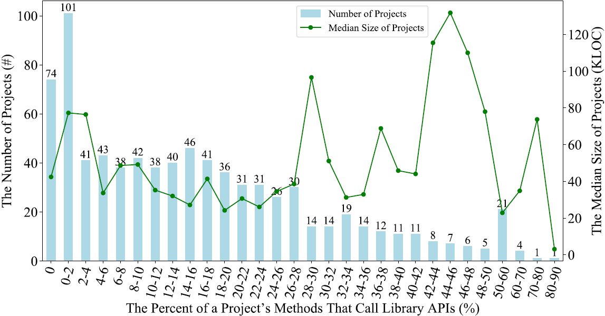
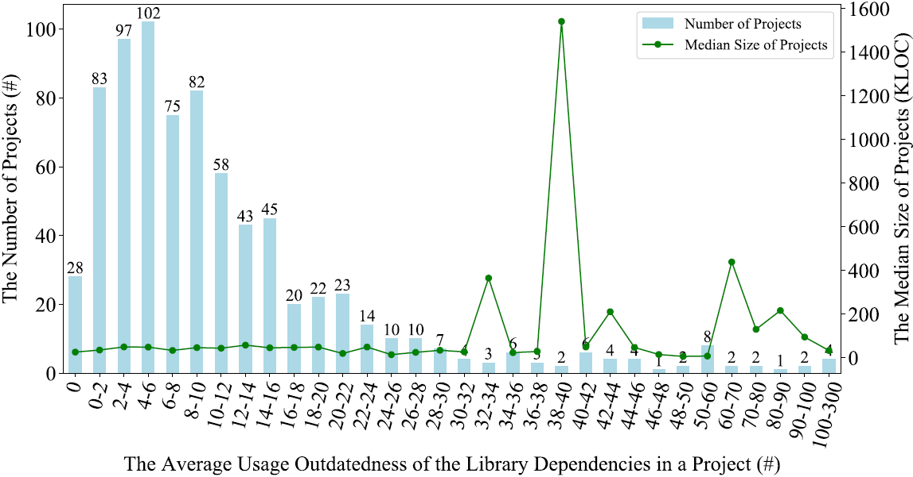
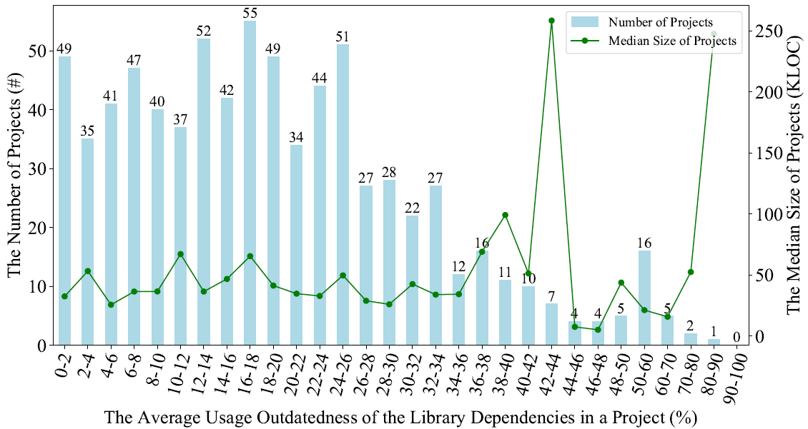
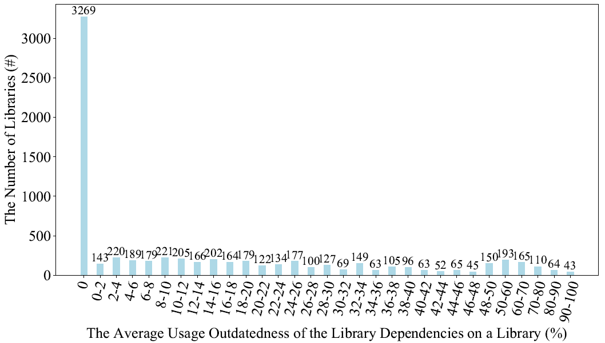

Third-party libraries play a key role in software development as they can relieve developers of the heavy burden of re-implementing common functionalities. However, third-party libraries and client projects evolve asynchronously. As a result, outdated third-party libraries may be still used in client projects while developers are not aware of their potential risk (e.g., security bug). Outdated third-party libraries may be updated in client projects in a delayed way, and developers may be less aware of the potential risk (e.g., API incompatibility) in updates. Developers of third-party libraries may be unaware of how their third-party libraries are used or updated in client projects. Therefore, a quantitative and holistic study on usages, updates and risks of third-party libraries in open-source projects can provide concrete evidences on these problems, and practical insights to improve the ecosystem. 

In this paper, we contribute such a study in Java ecosystem. In particular, we conduct a library usage analysis (e.g., usage intensity and outdatedness) and library update analysis (e.g., update intensity and delay) on 806 open-source projects and 13,565 third-party libraries. Then, we carry out a library risk analysis (e.g., usage risk and update risk) on 806 open-source projects and 544 security bugs. These analyses aim to quantify the usage and update practices as well as the potential risk of using and updating outdated third-party libraries with respect to security bugs holistically from two perspectives (i.e., opensource projects and third-party libraries). Our findings suggest practical implications to developers and researchers on problems and potential solutions in maintaining third-party libraries (e.g., smart alerting and automated updating of outdated third-party libraries). To indicate the usefulness of our findings, we design a smart alerting system for assisting developers to make confident decisions when updating third-party libraries. 33 and 24 open-source projects have confirmed and updated third-party libraries after receiving our alerts. The paper has been submitted to EMSE.

This page lists some supplementary results, provides the data set of our study, and releases the code for our library analysis and crawling and alerting system.

## Supplementary Results for Usage Intensity

#### Correlation between Project Size and Method-Level Usage Intensity

We analyzed the correlation between project size and method-level usage intensity, but found no statistically significant correlation.

## Supplementary Results for Usage Outdatedness

#### Correlation between Project Size and Usage Outdatedness

We analyzed the correlation between project size and usage outdatedness, but found no statistically significant correlation.

#### Usage Outdatednesd (From a Relative Perspective)

We also defined the usage outdatedness of a library dependency from a relative perspective, i.e., as the number of higher version releases of the library at the time of repository crawling divided by the number of all version releases. Therefore, the usage outdatedness of a library dependency is a value between 0 and 1, where 0 means using the latest version and 1 means using the oldest version.

## Detailed Results of Applying Our Alerting System

We omitted the project details (i.e., the first column) for anonymity.

<table>
   <tr>
      <td>Project</td>
      <td>NBL</td>
      <td>BL</td>
      <td>NB</td>
      <td>NA</td>
      <td>NC</td>
      <td>SL</td>
      <td>NAD</td>
      <td>NAM</td>
      <td>NCD</td>
      <td>NCM</td>
   </tr>
   <tr>
      <td>1</td>
      <td>1</td>
      <td>httpclient-4.3.jar</td>
      <td>1/3</td>
      <td>1/5</td>
      <td>1/7</td>
      <td>httpclient-4.5.9.jar</td>
      <td>0/5</td>
      <td>2/5</td>
      <td>0/7</td>
      <td>3/7</td>
   </tr>
   <tr>
      <td></td>
      <td></td>
      <td></td>
      <td></td>
     <td></td>
      <td></td>
      <td>httpclient-4.5.11.jar</td>
      <td>0/5</td>
      <td>2/5</td>
      <td>0/7</td>
      <td>3/7</td>
   </tr>
   <tr>
      <td></td>
      <td></td>
      <td></td>
      <td></td>
     <td></td>
      <td></td>
      <td>httpclient-4.5.5.jar</td>
      <td>0/5</td>
      <td>2/5</td>
      <td>0/7</td>
      <td>3/7</td>
   </tr>
   <tr>
      <td></td>
      <td></td>
      <td></td>
      <td></td>
     <td></td>
      <td></td>
      <td>httpclient-4.4-alpha1.jar</td>
      <td>0/5</td>
      <td>2/5</td>
      <td>0/7</td>
      <td>3/7</td>
   </tr>
   <tr>
      <td></td>
      <td></td>
      <td></td>
      <td></td>
     <td></td>
      <td></td>
      <td>httpclient-4.5.jar</td>
      <td>0/5</td>
      <td>2/5</td>
      <td>0/7</td>
      <td>3/7</td>
   </tr>
   <tr>
      <td></td>
      <td></td>
      <td></td>
      <td></td>
     <td></td>
      <td></td>
      <td>httpclient-4.4-beta1.jar</td>
      <td>0/5</td>
      <td>2/5</td>
      <td>0/7</td>
      <td>3/7</td>
   </tr>
   <tr>
      <td></td>
      <td></td>
      <td></td>
      <td></td>
     <td></td>
      <td></td>
      <td>httpclient-4.4.1.jar</td>
      <td>0/5</td>
      <td>2/5</td>
      <td>0/7</td>
      <td>3/7</td>
   </tr>
   <tr>
      <td></td>
      <td></td>
      <td></td>
      <td></td>
     <td></td>
      <td></td>
      <td>httpclient-4.4.jar</td>
      <td>0/5</td>
      <td>2/5</td>
      <td>0/7</td>
      <td>3/7</td>
   </tr>
   <tr>
      <td></td>
      <td></td>
      <td></td>
      <td></td>
     <td></td>
      <td></td>
      <td>httpclient-4.5.4.jar</td>
      <td>0/5</td>
      <td>2/5</td>
      <td>0/7</td>
      <td>3/7</td>
   </tr>
   <tr>
      <td></td>
      <td></td>
      <td></td>
      <td></td>
     <td></td>
      <td></td>
      <td>httpclient-4.5.10.jar</td>
      <td>0/5</td>
      <td>2/5</td>
      <td>0/7</td>
      <td>3/7</td>
   </tr>
   <tr>
      <td></td>
      <td></td>
      <td></td>
      <td></td>
     <td></td>
      <td></td>
      <td>httpclient-4.5.8.jar</td>
      <td>0/5</td>
      <td>2/5</td>
      <td>0/7</td>
      <td>3/7</td>
   </tr>
   <tr>
      <td></td>
      <td></td>
      <td></td>
      <td></td>
     <td></td>
      <td></td>
      <td>httpclient-4.5.7.jar</td>
      <td>0/5</td>
      <td>2/5</td>
      <td>0/7</td>
      <td>3/7</td>
   </tr>
   <tr>
      <td></td>
      <td></td>
      <td></td>
      <td></td>
     <td></td>
      <td></td>
      <td>httpclient-4.5.6.jar</td>
      <td>0/5</td>
      <td>2/5</td>
      <td>0/7</td>
      <td>3/7</td>
   </tr>
   <tr>
      <td></td>
      <td></td>
      <td></td>
      <td></td>
     <td></td>
      <td></td>
      <td>httpclient-4.5.3.jar</td>
      <td>0/5</td>
      <td>2/5</td>
      <td>0/7</td>
      <td>3/7</td>
   </tr>
   <tr>
      <td></td>
      <td></td>
      <td></td>
      <td></td>
     <td></td>
      <td></td>
      <td>httpclient-4.5.1.jar</td>
      <td>0/5</td>
      <td>2/5</td>
      <td>0/7</td>
      <td>3/7</td>
   </tr>
   <tr>
      <td></td>
      <td></td>
      <td></td>
      <td></td>
     <td></td>
      <td></td>
      <td>httpclient-4.5.2.jar</td>
      <td>0/5</td>
      <td>2/5</td>
      <td>0/7</td>
      <td>3/7</td>
   </tr>
   <tr>
      <td>2</td>
      <td>1</td>
      <td>pdfbox-1.8.9.jar</td>
      <td>1/2</td>
      <td>3/33</td>
      <td>5/76</td>
      <td>pdfbox-2.0.13.jar</td>
      <td>9/33</td>
      <td>18/33</td>
      <td>20/76</td>
      <td>46/76</td>
   </tr>
   <tr>
      <td></td>
      <td></td>
      <td></td>
      <td></td>
     <td></td>
      <td></td>
      <td>pdfbox-2.0.17.jar</td>
      <td>9/33</td>
      <td>18/33</td>
      <td>20/76</td>
      <td>46/76</td>
   </tr>
   <tr>
      <td></td>
      <td></td>
      <td></td>
      <td></td>
     <td></td>
      <td></td>
      <td>pdfbox-2.0.15.jar</td>
      <td>9/33</td>
      <td>18/33</td>
      <td>20/76</td>
      <td>46/76</td>
   </tr>
   <tr>
      <td></td>
      <td></td>
      <td></td>
      <td></td>
     <td></td>
      <td></td>
      <td>pdfbox-2.0.12.jar</td>
      <td>9/33</td>
      <td>18/33</td>
      <td>20/76</td>
      <td>46/76</td>
   </tr>
   <tr>
      <td></td>
      <td></td>
      <td></td>
      <td></td>
     <td></td>
      <td></td>
      <td>pdfbox-2.0.18.jar</td>
      <td>9/33</td>
      <td>18/33</td>
      <td>20/76</td>
      <td>46/76</td>
   </tr>
   <tr>
      <td></td>
      <td></td>
      <td></td>
      <td></td>
     <td></td>
      <td></td>
      <td>pdfbox-2.0.16.jar</td>
      <td>9/33</td>
      <td>18/33</td>
      <td>20/76</td>
      <td>46/76</td>
   </tr>
   <tr>
      <td>3</td>
      <td>1</td>
      <td>mysql-connector-java-5.1.31.jar</td>
      <td>2/5</td>
      <td>1/4</td>
      <td>1/4</td>
      <td>mysql-connector-java-8.0.17.jar</td>
      <td>4/4</td>
      <td>0/4</td>
      <td>4/4</td>
      <td>0/4</td>
   </tr>
   <tr>
      <td></td>
      <td></td>
      <td></td>
      <td></td>
     <td></td>
      <td></td>
      <td>mysql-connector-java-8.0.18.jar</td>
      <td>4/4</td>
      <td>0/4</td>
      <td>4/4</td>
      <td>0/4</td>
   </tr>
   <tr>
      <td></td>
      <td></td>
      <td></td>
      <td></td>
     <td></td>
      <td></td>
      <td>mysql-connector-java-8.0.16.jar</td>
      <td>4/4</td>
      <td>0/4</td>
      <td>4/4</td>
      <td>0/4</td>
   </tr>
   <tr>
      <td></td>
      <td></td>
      <td></td>
      <td></td>
     <td></td>
      <td></td>
      <td>mysql-connector-java-8.0.19.jar</td>
      <td>4/4</td>
      <td>0/4</td>
      <td>4/4</td>
      <td>0/4</td>
   </tr>
   <tr>
      <td>4</td>
      <td>1</td>
      <td>hadoop-common-2.9.1.jar</td>
      <td>1/2</td>
      <td>2/61</td>
      <td>2/142</td>
      <td>hadoop-common-3.1.2.jar</td>
      <td>12/61</td>
      <td>7/61</td>
      <td>36/142</td>
      <td>14/142</td>
   </tr>
   <tr>
      <td></td>
      <td></td>
      <td></td>
      <td></td>
     <td></td>
      <td></td>
      <td>hadoop-common-3.2.1.jar</td>
      <td>4/61</td>
      <td>16/61</td>
      <td>5/142</td>
      <td>47/142</td>
   </tr>
   <tr>
      <td></td>
      <td></td>
      <td></td>
      <td></td>
     <td></td>
      <td></td>
      <td>hadoop-common-3.1.1.jar</td>
      <td>12/61</td>
      <td>7/61</td>
      <td>36/142</td>
      <td>14/142</td>
   </tr>
   <tr>
      <td></td>
      <td></td>
      <td></td>
      <td></td>
     <td></td>
      <td></td>
      <td>hadoop-common-3.1.3.jar</td>
      <td>12/61</td>
      <td>7/61</td>
      <td>36/142</td>
      <td>14/142</td>
   </tr>
   <tr>
      <td></td>
      <td></td>
      <td></td>
      <td></td>
     <td></td>
      <td></td>
      <td>hadoop-common-3.2.0.jar</td>
      <td>4/61</td>
      <td>14/61</td>
      <td>5/142</td>
      <td>44/142</td>
   </tr>
   <tr>
      <td>5</td>
      <td>1</td>
      <td>commons-compress-1.17.jar</td>
      <td>1/2</td>
      <td>3/18</td>
      <td>6/44</td>
      <td>commons-compress-1.20.jar</td>
      <td>0/18</td>
      <td>11/18</td>
      <td>0/44</td>
      <td>23/44</td>
   </tr>
   <tr>
      <td></td>
      <td></td>
      <td></td>
      <td></td>
     <td></td>
      <td></td>
      <td>commons-compress-1.19.jar</td>
      <td>0/18</td>
      <td>11/18</td>
      <td>0/44</td>
      <td>23/44</td>
   </tr>
   <tr>
      <td>6</td>
      <td>1</td>
      <td>hadoop-common-2.7.1.jar</td>
      <td>1/7</td>
      <td>3/22</td>
      <td>5/66</td>
      <td>hadoop-common-3.1.2.jar</td>
      <td>2/22</td>
      <td>10/22</td>
      <td>7/66</td>
      <td>31/66</td>
   </tr>
   <tr>
      <td></td>
      <td></td>
      <td></td>
      <td></td>
     <td></td>
      <td></td>
      <td>hadoop-common-3.2.1.jar</td>
      <td>0/22</td>
      <td>12/22</td>
      <td>0/66</td>
      <td>38/66</td>
   </tr>
   <tr>
      <td></td>
      <td></td>
      <td></td>
      <td></td>
     <td></td>
      <td></td>
      <td>hadoop-common-3.1.1.jar</td>
      <td>2/22</td>
      <td>10/22</td>
      <td>7/66</td>
      <td>31/66</td>
   </tr>
   <tr>
      <td></td>
      <td></td>
      <td></td>
      <td></td>
     <td></td>
      <td></td>
      <td>hadoop-common-3.1.3.jar</td>
      <td>2/22</td>
      <td>10/22</td>
      <td>7/66</td>
      <td>31/66</td>
   </tr>
   <tr>
      <td></td>
      <td></td>
      <td></td>
      <td></td>
     <td></td>
      <td></td>
      <td>hadoop-common-3.2.0.jar</td>
      <td>0/22</td>
      <td>12/22</td>
      <td>0/66</td>
      <td>38/66</td>
   </tr>
   <tr>
      <td>7</td>
      <td>2</td>
      <td>hadoop-common-2.5.1.jar</td>
      <td>1/4</td>
      <td>1/16</td>
      <td>1/46</td>
      <td>hadoop-common-3.1.2.jar</td>
      <td>1/16</td>
      <td>0/16</td>
      <td>1/46</td>
      <td>0/46</td>
   </tr>
   <tr>
      <td></td>
      <td></td>
      <td></td>
      <td></td>
     <td></td>
      <td></td>
      <td>hadoop-common-3.2.1.jar</td>
      <td>0/16</td>
      <td>1/16</td>
      <td>0/46</td>
      <td>1/46</td>
   </tr>
   <tr>
      <td></td>
      <td></td>
      <td></td>
      <td></td>
     <td></td>
      <td></td>
      <td>hadoop-common-3.1.1.jar</td>
      <td>1/16</td>
      <td>0/16</td>
      <td>1/46</td>
      <td>0/46</td>
   </tr>
   <tr>
      <td></td>
      <td></td>
      <td></td>
      <td></td>
     <td></td>
      <td></td>
      <td>hadoop-common-3.1.3.jar</td>
      <td>1/16</td>
      <td>0/16</td>
      <td>1/46</td>
      <td>0/46</td>
   </tr>
   <tr>
      <td></td>
      <td></td>
      <td></td>
      <td></td>
     <td></td>
      <td></td>
      <td>hadoop-common-3.2.0.jar</td>
      <td>0/16</td>
      <td>1/16</td>
      <td>0/46</td>
      <td>1/46</td>
   </tr>
   <tr>
      <td></td>
      <td></td>
      <td>zookeeper-3.4.5.jar</td>
      <td>1/4</td>
      <td>1/18</td>
      <td>1/52</td>
      <td>zookeeper-3.5.5.jar</td>
      <td>0/18</td>
      <td>14/18</td>
      <td>0/52</td>
      <td>35/52</td>
   </tr>
   <tr>
      <td></td>
      <td></td>
      <td></td>
      <td></td>
     <td></td>
      <td></td>
      <td>zookeeper-3.4.14.jar</td>
      <td>0/18</td>
      <td>13/18</td>
      <td>0/52</td>
      <td>34/52</td>
   </tr>
   <tr>
      <td></td>
      <td></td>
      <td></td>
      <td></td>
     <td></td>
      <td></td>
      <td>zookeeper-3.5.7.jar</td>
      <td>0/18</td>
      <td>14/18</td>
      <td>0/52</td>
      <td>35/52</td>
   </tr>
   <tr>
      <td></td>
      <td></td>
      <td></td>
      <td></td>
     <td></td>
      <td></td>
      <td>zookeeper-3.5.6.jar</td>
      <td>0/18</td>
      <td>14/18</td>
      <td>0/52</td>
      <td>35/52</td>
   </tr>
   <tr>
      <td>8</td>
      <td>1</td>
      <td>slf4j-ext-1.7.25.jar</td>
      <td>1/1</td>
      <td>9/19</td>
      <td>11/23</td>
      <td>slf4j-ext-1.7.26.jar</td>
      <td>12/19</td>
      <td>0/19</td>
      <td>14/23</td>
      <td>0/23</td>
   </tr>
   <tr>
      <td></td>
      <td></td>
      <td></td>
      <td></td>
     <td></td>
      <td></td>
      <td>slf4j-ext-1.8.0-beta2.jar</td>
      <td>0/19</td>
      <td>0/19</td>
      <td>0/23</td>
      <td>0/23</td>
   </tr>
   <tr>
      <td></td>
      <td></td>
      <td></td>
      <td></td>
     <td></td>
      <td></td>
      <td>slf4j-ext-2.0.0-alpha0.jar</td>
      <td>12/19</td>
      <td>0/19</td>
      <td>14/23</td>
      <td>0/23</td>
   </tr>
   <tr>
      <td></td>
      <td></td>
      <td></td>
      <td></td>
     <td></td>
      <td></td>
      <td>slf4j-ext-1.8.0-beta4.jar</td>
      <td>12/19</td>
      <td>0/19</td>
      <td>14/23</td>
      <td>0/23</td>
   </tr>
   <tr>
      <td></td>
      <td></td>
      <td></td>
      <td></td>
     <td></td>
      <td></td>
      <td>slf4j-ext-1.7.30.jar</td>
      <td>12/19</td>
      <td>0/19</td>
      <td>14/23</td>
      <td>0/23</td>
   </tr>
   <tr>
      <td></td>
      <td></td>
      <td></td>
      <td></td>
     <td></td>
      <td></td>
      <td>slf4j-ext-1.7.29.jar</td>
      <td>12/19</td>
      <td>0/19</td>
      <td>14/23</td>
      <td>0/23</td>
   </tr>
   <tr>
      <td></td>
      <td></td>
      <td></td>
      <td></td>
     <td></td>
      <td></td>
      <td>slf4j-ext-1.7.28.jar</td>
      <td>12/19</td>
      <td>0/19</td>
      <td>14/23</td>
      <td>0/23</td>
   </tr>
   <tr>
      <td></td>
      <td></td>
      <td></td>
      <td></td>
     <td></td>
      <td></td>
      <td>slf4j-ext-1.7.27.jar</td>
      <td>12/19</td>
      <td>0/19</td>
      <td>14/23</td>
      <td>0/23</td>
   </tr>
   <tr>
      <td></td>
      <td></td>
      <td></td>
      <td></td>
     <td></td>
      <td></td>
      <td>slf4j-ext-2.0.0-alpha1.jar</td>
      <td>12/19</td>
      <td>0/19</td>
      <td>14/23</td>
      <td>0/23</td>
   </tr>
   <tr>
      <td>9</td>
      <td>1</td>
      <td>hive-exec-2.1.0.jar</td>
      <td>1/3</td>
      <td>1/32</td>
      <td>1/35</td>
      <td>hive-exec-3.1.1.jar</td>
      <td>2/32</td>
      <td>3/32</td>
      <td>2/35</td>
      <td>3/35</td>
   </tr>
   <tr>
      <td></td>
      <td></td>
      <td></td>
      <td></td>
     <td></td>
      <td></td>
      <td>hive-exec-2.3.5.jar</td>
      <td>0/32</td>
      <td>5/32</td>
      <td>0/35</td>
      <td>5/35</td>
   </tr>
   <tr>
      <td></td>
      <td></td>
      <td></td>
      <td></td>
     <td></td>
      <td></td>
      <td>hive-exec-2.3.4.jar</td>
      <td>0/32</td>
      <td>5/32</td>
      <td>0/35</td>
      <td>5/35</td>
   </tr>
   <tr>
      <td></td>
      <td></td>
      <td></td>
      <td></td>
     <td></td>
      <td></td>
      <td>hive-exec-2.3.6.jar</td>
      <td>0/32</td>
      <td>5/32</td>
      <td>0/35</td>
      <td>5/35</td>
   </tr>
   <tr>
      <td></td>
      <td></td>
      <td></td>
      <td></td>
     <td></td>
      <td></td>
      <td>hive-exec-3.1.2.jar</td>
      <td>2/32</td>
      <td>3/32</td>
      <td>2/35</td>
      <td>3/35</td>
   </tr>
   <tr>
      <td>10</td>
      <td>1</td>
      <td>hadoop-common-2.7.1.jar</td>
      <td>1/7</td>
      <td>12/81</td>
      <td>47/337</td>
      <td>hadoop-common-3.1.2.jar</td>
      <td>16/81</td>
      <td>22/81</td>
      <td>101/337</td>
      <td>92/337</td>
   </tr>
   <tr>
      <td></td>
      <td></td>
      <td></td>
      <td></td>
     <td></td>
      <td></td>
      <td>hadoop-common-3.2.1.jar</td>
      <td>1/81</td>
      <td>38/81</td>
      <td>31/337</td>
      <td>164/337</td>
   </tr>
   <tr>
      <td></td>
      <td></td>
      <td></td>
      <td></td>
     <td></td>
      <td></td>
      <td>hadoop-common-3.1.1.jar</td>
      <td>16/81</td>
      <td>22/81</td>
      <td>101/337</td>
      <td>92/337</td>
   </tr>
   <tr>
      <td></td>
      <td></td>
      <td></td>
      <td></td>
     <td></td>
      <td></td>
      <td>hadoop-common-3.1.3.jar</td>
      <td>16/81</td>
      <td>23/81</td>
      <td>101/337</td>
      <td>94/337</td>
   </tr>
   <tr>
      <td></td>
      <td></td>
      <td></td>
      <td></td>
     <td></td>
      <td></td>
      <td>hadoop-common-3.2.0.jar</td>
      <td>1/81</td>
      <td>37/81</td>
      <td>31/337</td>
      <td>162/337</td>
   </tr>
   <tr>
      <td>11</td>
      <td>1</td>
      <td>hadoop-common-2.6.3.jar</td>
      <td>1/7</td>
      <td>6/51</td>
      <td>45/303</td>
      <td>hadoop-common-3.1.2.jar</td>
      <td>4/51</td>
      <td>13/51</td>
      <td>36/303</td>
      <td>48/303</td>
   </tr>
   <tr>
      <td></td>
      <td></td>
      <td></td>
      <td></td>
     <td></td>
      <td></td>
      <td>hadoop-common-3.2.1.jar</td>
      <td>0/51</td>
      <td>17/51</td>
      <td>0/303</td>
      <td>84/303</td>
   </tr>
   <tr>
      <td></td>
      <td></td>
      <td></td>
      <td></td>
     <td></td>
      <td></td>
      <td>hadoop-common-3.1.1.jar</td>
      <td>4/51</td>
      <td>13/51</td>
      <td>36/303</td>
      <td>48/303</td>
   </tr>
   <tr>
      <td></td>
      <td></td>
      <td></td>
      <td></td>
     <td></td>
      <td></td>
      <td>hadoop-common-3.1.3.jar</td>
      <td>4/51</td>
      <td>13/51</td>
      <td>36/303</td>
      <td>48/303</td>
   </tr>
   <tr>
      <td></td>
      <td></td>
      <td></td>
      <td></td>
     <td></td>
      <td></td>
      <td>hadoop-common-3.2.0.jar</td>
      <td>0/51</td>
      <td>17/51</td>
      <td>0/303</td>
      <td>84/303</td>
   </tr>
   <tr>
      <td>12</td>
      <td>1</td>
      <td>tika-core-1.18.jar</td>
      <td>1/4</td>
      <td>2/16</td>
      <td>5/36</td>
      <td>tika-core-1.23.jar</td>
      <td>0/16</td>
      <td>8/16</td>
      <td>0/36</td>
      <td>21/36</td>
   </tr>
   <tr>
      <td></td>
      <td></td>
      <td></td>
      <td></td>
     <td></td>
      <td></td>
      <td>tika-core-1.22.jar</td>
      <td>0/16</td>
      <td>3/16</td>
      <td>0/36</td>
      <td>6/36</td>
   </tr>
   <tr>
      <td>13</td>
      <td>1</td>
      <td>pdfbox-1.8.10.jar</td>
      <td>1/2</td>
      <td>3/40</td>
      <td>4/68</td>
      <td>pdfbox-2.0.13.jar</td>
      <td>27/40</td>
      <td>6/40</td>
      <td>41/68</td>
      <td>10/68</td>
   </tr>
   <tr>
      <td></td>
      <td></td>
      <td></td>
      <td></td>
     <td></td>
      <td></td>
      <td>pdfbox-2.0.17.jar</td>
      <td>27/40</td>
      <td>6/40</td>
      <td>41/68</td>
      <td>10/68</td>
   </tr>
   <tr>
      <td></td>
      <td></td>
      <td></td>
      <td></td>
     <td></td>
      <td></td>
      <td>pdfbox-2.0.15.jar</td>
      <td>27/40</td>
      <td>6/40</td>
      <td>41/68</td>
      <td>10/68</td>
   </tr>
   <tr>
      <td></td>
      <td></td>
      <td></td>
      <td></td>
     <td></td>
      <td></td>
      <td>pdfbox-2.0.12.jar</td>
      <td>27/40</td>
      <td>6/40</td>
      <td>41/68</td>
      <td>10/68</td>
   </tr>
   <tr>
      <td></td>
      <td></td>
      <td></td>
      <td></td>
     <td></td>
      <td></td>
      <td>pdfbox-2.0.18.jar</td>
      <td>27/40</td>
      <td>6/40</td>
      <td>41/68</td>
      <td>10/68</td>
   </tr>
   <tr>
      <td></td>
      <td></td>
      <td></td>
      <td></td>
     <td></td>
      <td></td>
      <td>pdfbox-2.0.16.jar</td>
      <td>27/40</td>
      <td>6/40</td>
      <td>41/68</td>
      <td>10/68</td>
   </tr>
   <tr>
      <td>14</td>
      <td>1</td>
      <td>spring-security-config-4.1.0.RELEASE.jar</td>
      <td>1/2</td>
      <td>1/3</td>
      <td>1/3</td>
      <td>spring-security-config-5.1.5.RELEASE.jar</td>
      <td>0/3</td>
      <td>2/3</td>
      <td>0/3</td>
      <td>2/3</td>
   </tr>
   <tr>
      <td></td>
      <td></td>
      <td></td>
      <td></td>
     <td></td>
      <td></td>
      <td>spring-security-config-5.1.0.RELEASE.jar</td>
      <td>0/3</td>
      <td>2/3</td>
      <td>0/3</td>
      <td>2/3</td>
   </tr>
   <tr>
      <td></td>
      <td></td>
      <td></td>
      <td></td>
     <td></td>
      <td></td>
      <td>spring-security-config-5.0.10.RELEASE.jar</td>
      <td>0/3</td>
      <td>2/3</td>
      <td>0/3</td>
      <td>2/3</td>
   </tr>
   <tr>
      <td></td>
      <td></td>
      <td></td>
      <td></td>
     <td></td>
      <td></td>
      <td>spring-security-config-5.1.3.RELEASE.jar</td>
      <td>0/3</td>
      <td>2/3</td>
      <td>0/3</td>
      <td>2/3</td>
   </tr>
   <tr>
      <td></td>
      <td></td>
      <td></td>
      <td></td>
     <td></td>
      <td></td>
      <td>spring-security-config-5.2.2.RELEASE.jar</td>
      <td>0/3</td>
      <td>3/3</td>
      <td>0/3</td>
      <td>3/3</td>
   </tr>
   <tr>
      <td></td>
      <td></td>
      <td></td>
      <td></td>
     <td></td>
      <td></td>
      <td>spring-security-config-5.0.11.RELEASE.jar</td>
      <td>0/3</td>
      <td>2/3</td>
      <td>0/3</td>
      <td>2/3</td>
   </tr>
   <tr>
      <td></td>
      <td></td>
      <td></td>
      <td></td>
     <td></td>
      <td></td>
      <td>spring-security-config-5.1.7.RELEASE.jar</td>
      <td>0/3</td>
      <td>2/3</td>
      <td>0/3</td>
      <td>2/3</td>
   </tr>
   <tr>
      <td></td>
      <td></td>
      <td></td>
      <td></td>
     <td></td>
      <td></td>
      <td>spring-security-config-5.2.0.RELEASE.jar</td>
      <td>0/3</td>
      <td>3/3</td>
      <td>0/3</td>
      <td>3/3</td>
   </tr>
   <tr>
      <td></td>
      <td></td>
      <td></td>
      <td></td>
     <td></td>
      <td></td>
      <td>spring-security-config-5.1.1.RELEASE.jar</td>
      <td>0/3</td>
      <td>2/3</td>
      <td>0/3</td>
      <td>2/3</td>
   </tr>
   <tr>
      <td></td>
      <td></td>
      <td></td>
      <td></td>
     <td></td>
      <td></td>
      <td>spring-security-config-5.0.6.RELEASE.jar</td>
      <td>0/3</td>
      <td>2/3</td>
      <td>0/3</td>
      <td>2/3</td>
   </tr>
   <tr>
      <td></td>
      <td></td>
      <td></td>
      <td></td>
     <td></td>
      <td></td>
      <td>spring-security-config-5.0.7.RELEASE.jar</td>
      <td>0/3</td>
      <td>2/3</td>
      <td>0/3</td>
      <td>2/3</td>
   </tr>
   <tr>
      <td></td>
      <td></td>
      <td></td>
      <td></td>
     <td></td>
      <td></td>
      <td>spring-security-config-4.2.13.RELEASE.jar</td>
      <td>0/3</td>
      <td>2/3</td>
      <td>0/3</td>
      <td>2/3</td>
   </tr>
   <tr>
      <td></td>
      <td></td>
      <td></td>
      <td></td>
     <td></td>
      <td></td>
      <td>spring-security-config-5.0.13.RELEASE.jar</td>
      <td>0/3</td>
      <td>2/3</td>
      <td>0/3</td>
      <td>2/3</td>
   </tr>
   <tr>
      <td></td>
      <td></td>
      <td></td>
      <td></td>
     <td></td>
      <td></td>
      <td>spring-security-config-5.2.1.RELEASE.jar</td>
      <td>0/3</td>
      <td>3/3</td>
      <td>0/3</td>
      <td>3/3</td>
   </tr>
   <tr>
      <td></td>
      <td></td>
      <td></td>
      <td></td>
     <td></td>
      <td></td>
      <td>spring-security-config-5.1.6.RELEASE.jar</td>
      <td>0/3</td>
      <td>2/3</td>
      <td>0/3</td>
      <td>2/3</td>
   </tr>
   <tr>
      <td></td>
      <td></td>
      <td></td>
      <td></td>
     <td></td>
      <td></td>
      <td>spring-security-config-5.1.8.RELEASE.jar</td>
      <td>0/3</td>
      <td>2/3</td>
      <td>0/3</td>
      <td>2/3</td>
   </tr>
   <tr>
      <td></td>
      <td></td>
      <td></td>
      <td></td>
     <td></td>
      <td></td>
      <td>spring-security-config-4.2.14.RELEASE.jar</td>
      <td>0/3</td>
      <td>2/3</td>
      <td>0/3</td>
      <td>2/3</td>
   </tr>
   <tr>
      <td></td>
      <td></td>
      <td></td>
      <td></td>
     <td></td>
      <td></td>
      <td>spring-security-config-5.0.12.RELEASE.jar</td>
      <td>0/3</td>
      <td>2/3</td>
      <td>0/3</td>
      <td>2/3</td>
   </tr>
   <tr>
      <td></td>
      <td></td>
      <td></td>
      <td></td>
     <td></td>
      <td></td>
      <td>spring-security-config-5.0.14.RELEASE.jar</td>
      <td>0/3</td>
      <td>2/3</td>
      <td>0/3</td>
      <td>2/3</td>
   </tr>
   <tr>
      <td></td>
      <td></td>
      <td></td>
      <td></td>
     <td></td>
      <td></td>
      <td>spring-security-config-5.0.8.RELEASE.jar</td>
      <td>0/3</td>
      <td>2/3</td>
      <td>0/3</td>
      <td>2/3</td>
   </tr>
   <tr>
      <td></td>
      <td></td>
      <td></td>
      <td></td>
     <td></td>
      <td></td>
      <td>spring-security-config-5.0.9.RELEASE.jar</td>
      <td>0/3</td>
      <td>2/3</td>
      <td>0/3</td>
      <td>2/3</td>
   </tr>
   <tr>
      <td></td>
      <td></td>
      <td></td>
      <td></td>
     <td></td>
      <td></td>
      <td>spring-security-config-5.1.4.RELEASE.jar</td>
      <td>0/3</td>
      <td>2/3</td>
      <td>0/3</td>
      <td>2/3</td>
   </tr>
   <tr>
      <td></td>
      <td></td>
      <td></td>
      <td></td>
     <td></td>
      <td></td>
      <td>spring-security-config-5.1.2.RELEASE.jar</td>
      <td>0/3</td>
      <td>2/3</td>
      <td>0/3</td>
      <td>2/3</td>
   </tr>
   <tr>
      <td>15</td>
      <td>1</td>
      <td>hadoop-common-2.7.3.jar</td>
      <td>1/5</td>
      <td>5/11</td>
      <td>6/20</td>
      <td>hadoop-common-3.1.2.jar</td>
      <td>3/11</td>
      <td>5/11</td>
      <td>4/20</td>
      <td>7/20</td>
   </tr>
   <tr>
      <td></td>
      <td></td>
      <td></td>
      <td></td>
     <td></td>
      <td></td>
      <td>hadoop-common-3.2.1.jar</td>
      <td>0/11</td>
      <td>8/11</td>
      <td>0/20</td>
      <td>11/20</td>
   </tr>
   <tr>
      <td></td>
      <td></td>
      <td></td>
      <td></td>
     <td></td>
      <td></td>
      <td>hadoop-common-3.1.1.jar</td>
      <td>3/11</td>
      <td>5/11</td>
      <td>4/20</td>
      <td>7/20</td>
   </tr>
   <tr>
      <td></td>
      <td></td>
      <td></td>
      <td></td>
     <td></td>
      <td></td>
      <td>hadoop-common-3.1.3.jar</td>
      <td>3/11</td>
      <td>5/11</td>
      <td>4/20</td>
      <td>7/20</td>
   </tr>
   <tr>
      <td></td>
      <td></td>
      <td></td>
      <td></td>
     <td></td>
      <td></td>
      <td>hadoop-common-3.2.0.jar</td>
      <td>0/11</td>
      <td>8/11</td>
      <td>0/20</td>
      <td>11/20</td>
   </tr>
   <tr>
      <td>16</td>
      <td>1</td>
      <td>uimaj-core-2.6.0.jar</td>
      <td>1/1</td>
      <td>1/68</td>
      <td>1/221</td>
      <td>uimaj-core-3.1.1.jar</td>
      <td>13/68</td>
      <td>26/68</td>
      <td>31/221</td>
      <td>95/221</td>
   </tr>
   <tr>
      <td></td>
      <td></td>
      <td></td>
      <td></td>
     <td></td>
      <td></td>
      <td>uimaj-core-2.10.3.jar</td>
      <td>0/68</td>
      <td>31/68</td>
      <td>0/221</td>
      <td>115/221</td>
   </tr>
   <tr>
      <td></td>
      <td></td>
      <td></td>
      <td></td>
     <td></td>
      <td></td>
      <td>uimaj-core-3.0.2.jar</td>
      <td>13/68</td>
      <td>26/68</td>
      <td>31/221</td>
      <td>95/221</td>
   </tr>
   <tr>
      <td></td>
      <td></td>
      <td></td>
      <td></td>
     <td></td>
      <td></td>
      <td>uimaj-core-2.10.2.jar</td>
      <td>0/68</td>
      <td>31/68</td>
      <td>0/221</td>
      <td>115/221</td>
   </tr>
   <tr>
      <td></td>
      <td></td>
      <td></td>
      <td></td>
     <td></td>
      <td></td>
      <td>uimaj-core-3.0.0.jar</td>
      <td>13/68</td>
      <td>26/68</td>
      <td>31/221</td>
      <td>95/221</td>
   </tr>
   <tr>
      <td></td>
      <td></td>
      <td></td>
      <td></td>
     <td></td>
      <td></td>
      <td>uimaj-core-3.0.0-beta.jar</td>
      <td>13/68</td>
      <td>26/68</td>
      <td>31/221</td>
      <td>95/221</td>
   </tr>
   <tr>
      <td></td>
      <td></td>
      <td></td>
      <td></td>
     <td></td>
      <td></td>
      <td>uimaj-core-3.0.1.jar</td>
      <td>13/68</td>
      <td>26/68</td>
      <td>31/221</td>
      <td>95/221</td>
   </tr>
   <tr>
      <td></td>
      <td></td>
      <td></td>
      <td></td>
     <td></td>
      <td></td>
      <td>uimaj-core-3.1.0.jar</td>
      <td>13/68</td>
      <td>26/68</td>
      <td>31/221</td>
      <td>95/221</td>
   </tr>
   <tr>
      <td></td>
      <td></td>
      <td></td>
      <td></td>
     <td></td>
      <td></td>
      <td>uimaj-core-2.10.4.jar</td>
      <td>0/68</td>
      <td>31/68</td>
      <td>0/221</td>
      <td>115/221</td>
   </tr>
   <tr>
      <td>17</td>
      <td>1</td>
      <td>hadoop-common-2.7.3.jar</td>
      <td>1/5</td>
      <td>1/5</td>
      <td>1/11</td>
      <td>hadoop-common-3.1.2.jar</td>
      <td>1/5</td>
      <td>2/5</td>
      <td>1/11</td>
      <td>8/11</td>
   </tr>
   <tr>
      <td></td>
      <td></td>
      <td></td>
      <td></td>
     <td></td>
      <td></td>
      <td>hadoop-common-3.2.1.jar</td>
      <td>0/5</td>
      <td>3/5</td>
      <td>0/11</td>
      <td>9/11</td>
   </tr>
   <tr>
      <td></td>
      <td></td>
      <td></td>
      <td></td>
     <td></td>
      <td></td>
      <td>hadoop-common-3.1.1.jar</td>
      <td>1/5</td>
      <td>2/5</td>
      <td>1/11</td>
      <td>8/11</td>
   </tr>
   <tr>
      <td></td>
      <td></td>
      <td></td>
      <td></td>
     <td></td>
      <td></td>
      <td>hadoop-common-3.1.3.jar</td>
      <td>1/5</td>
      <td>2/5</td>
      <td>1/11</td>
      <td>8/11</td>
   </tr>
   <tr>
      <td></td>
      <td></td>
      <td></td>
      <td></td>
     <td></td>
      <td></td>
      <td>hadoop-common-3.2.0.jar</td>
      <td>0/5</td>
      <td>3/5</td>
      <td>0/11</td>
      <td>9/11</td>
   </tr>
   <tr>
      <td>18</td>
      <td>1</td>
      <td>httpclient-4.3.jar</td>
      <td>1/3</td>
      <td>1/7</td>
      <td>1/7</td>
      <td>httpclient-4.5.9.jar</td>
      <td>0/7</td>
      <td>2/7</td>
      <td>0/7</td>
      <td>2/7</td>
   </tr>
   <tr>
      <td></td>
      <td></td>
      <td></td>
      <td></td>
     <td></td>
      <td></td>
      <td>httpclient-4.5.11.jar</td>
      <td>0/7</td>
      <td>2/7</td>
      <td>0/7</td>
      <td>2/7</td>
   </tr>
   <tr>
      <td></td>
      <td></td>
      <td></td>
      <td></td>
     <td></td>
      <td></td>
      <td>httpclient-4.5.5.jar</td>
      <td>0/7</td>
      <td>2/7</td>
      <td>0/7</td>
      <td>2/7</td>
   </tr>
   <tr>
      <td></td>
      <td></td>
      <td></td>
      <td></td>
     <td></td>
      <td></td>
      <td>httpclient-4.4-alpha1.jar</td>
      <td>0/7</td>
      <td>2/7</td>
      <td>0/7</td>
      <td>2/7</td>
   </tr>
   <tr>
      <td></td>
      <td></td>
      <td></td>
      <td></td>
     <td></td>
      <td></td>
      <td>httpclient-4.5.jar</td>
      <td>0/7</td>
      <td>2/7</td>
      <td>0/7</td>
      <td>2/7</td>
   </tr>
   <tr>
      <td></td>
      <td></td>
      <td></td>
      <td></td>
     <td></td>
      <td></td>
      <td>httpclient-4.4-beta1.jar</td>
      <td>0/7</td>
      <td>2/7</td>
      <td>0/7</td>
      <td>2/7</td>
   </tr>
   <tr>
      <td></td>
      <td></td>
      <td></td>
      <td></td>
     <td></td>
      <td></td>
      <td>httpclient-4.4.1.jar</td>
      <td>0/7</td>
      <td>2/7</td>
      <td>0/7</td>
      <td>2/7</td>
   </tr>
   <tr>
      <td></td>
      <td></td>
      <td></td>
      <td></td>
     <td></td>
      <td></td>
      <td>httpclient-4.4.jar</td>
      <td>0/7</td>
      <td>2/7</td>
      <td>0/7</td>
      <td>2/7</td>
   </tr>
   <tr>
      <td></td>
      <td></td>
      <td></td>
      <td></td>
     <td></td>
      <td></td>
      <td>httpclient-4.5.4.jar</td>
      <td>0/7</td>
      <td>2/7</td>
      <td>0/7</td>
      <td>2/7</td>
   </tr>
   <tr>
      <td></td>
      <td></td>
      <td></td>
      <td></td>
     <td></td>
      <td></td>
      <td>httpclient-4.5.10.jar</td>
      <td>0/7</td>
      <td>2/7</td>
      <td>0/7</td>
      <td>2/7</td>
   </tr>
   <tr>
      <td></td>
      <td></td>
      <td></td>
      <td></td>
     <td></td>
      <td></td>
      <td>httpclient-4.5.8.jar</td>
      <td>0/7</td>
      <td>2/7</td>
      <td>0/7</td>
      <td>2/7</td>
   </tr>
   <tr>
      <td></td>
      <td></td>
      <td></td>
      <td></td>
     <td></td>
      <td></td>
      <td>httpclient-4.5.7.jar</td>
      <td>0/7</td>
      <td>2/7</td>
      <td>0/7</td>
      <td>2/7</td>
   </tr>
   <tr>
      <td></td>
      <td></td>
      <td></td>
      <td></td>
     <td></td>
      <td></td>
      <td>httpclient-4.5.6.jar</td>
      <td>0/7</td>
      <td>2/7</td>
      <td>0/7</td>
      <td>2/7</td>
   </tr>
   <tr>
      <td></td>
      <td></td>
      <td></td>
      <td></td>
     <td></td>
      <td></td>
      <td>httpclient-4.5.3.jar</td>
      <td>0/7</td>
      <td>2/7</td>
      <td>0/7</td>
      <td>2/7</td>
   </tr>
   <tr>
      <td></td>
      <td></td>
      <td></td>
      <td></td>
     <td></td>
      <td></td>
      <td>httpclient-4.5.1.jar</td>
      <td>0/7</td>
      <td>2/7</td>
      <td>0/7</td>
      <td>2/7</td>
   </tr>
   <tr>
      <td></td>
      <td></td>
      <td></td>
      <td></td>
     <td></td>
      <td></td>
      <td>httpclient-4.5.2.jar</td>
      <td>0/7</td>
      <td>2/7</td>
      <td>0/7</td>
      <td>2/7</td>
   </tr>
   <tr>
      <td>19</td>
      <td>1</td>
      <td>mysql-connector-java-5.1.35.jar</td>
      <td>1/4</td>
      <td>1/6</td>
      <td>2/10</td>
      <td>mysql-connector-java-8.0.17.jar</td>
      <td>6/6</td>
      <td>0/6</td>
      <td>10/10</td>
      <td>0/10</td>
   </tr>
   <tr>
      <td></td>
      <td></td>
      <td></td>
      <td></td>
     <td></td>
      <td></td>
      <td>mysql-connector-java-8.0.18.jar</td>
      <td>6/6</td>
      <td>0/6</td>
      <td>10/10</td>
      <td>0/10</td>
   </tr>
   <tr>
      <td></td>
      <td></td>
      <td></td>
      <td></td>
     <td></td>
      <td></td>
      <td>mysql-connector-java-8.0.16.jar</td>
      <td>6/6</td>
      <td>0/6</td>
      <td>10/10</td>
      <td>0/10</td>
   </tr>
   <tr>
      <td></td>
      <td></td>
      <td></td>
      <td></td>
     <td></td>
      <td></td>
      <td>mysql-connector-java-8.0.19.jar</td>
      <td>6/6</td>
      <td>0/6</td>
      <td>10/10</td>
      <td>0/10</td>
   </tr>
   <tr>
      <td>20</td>
      <td>1</td>
      <td>hadoop-common-2.6.0.jar</td>
      <td>1/7</td>
      <td>2/5</td>
      <td>3/6</td>
      <td>hadoop-common-3.1.2.jar</td>
      <td>3/5</td>
      <td>2/5</td>
      <td>4/6</td>
      <td>2/6</td>
   </tr>
   <tr>
      <td></td>
      <td></td>
      <td></td>
      <td></td>
     <td></td>
      <td></td>
      <td>hadoop-common-3.2.1.jar</td>
      <td>0/5</td>
      <td>5/5</td>
      <td>0/6</td>
      <td>6/6</td>
   </tr>
   <tr>
      <td></td>
      <td></td>
      <td></td>
      <td></td>
     <td></td>
      <td></td>
      <td>hadoop-common-3.1.1.jar</td>
      <td>3/5</td>
      <td>2/5</td>
      <td>4/6</td>
      <td>2/6</td>
   </tr>
   <tr>
      <td></td>
      <td></td>
      <td></td>
      <td></td>
     <td></td>
      <td></td>
      <td>hadoop-common-3.1.3.jar</td>
      <td>3/5</td>
      <td>2/5</td>
      <td>4/6</td>
      <td>2/6</td>
   </tr>
   <tr>
      <td></td>
      <td></td>
      <td></td>
      <td></td>
     <td></td>
      <td></td>
      <td>hadoop-common-3.2.0.jar</td>
      <td>0/5</td>
      <td>5/5</td>
      <td>0/6</td>
      <td>6/6</td>
   </tr>
   <tr>
      <td>21</td>
      <td>3</td>
      <td>hadoop-common-2.7.3.jar</td>
      <td>1/5</td>
      <td>2/20</td>
      <td>13/36</td>
      <td>hadoop-common-3.1.2.jar</td>
      <td>0/20</td>
      <td>10/20</td>
      <td>0/36</td>
      <td>24/36</td>
   </tr>
   <tr>
      <td></td>
      <td></td>
      <td></td>
      <td></td>
     <td></td>
      <td></td>
      <td>hadoop-common-3.2.1.jar</td>
      <td>0/20</td>
      <td>10/20</td>
      <td>0/36</td>
      <td>24/36</td>
   </tr>
   <tr>
      <td></td>
      <td></td>
      <td></td>
      <td></td>
     <td></td>
      <td></td>
      <td>hadoop-common-3.1.1.jar</td>
      <td>0/20</td>
      <td>10/20</td>
      <td>0/36</td>
      <td>24/36</td>
   </tr>
   <tr>
      <td></td>
      <td></td>
      <td></td>
      <td></td>
     <td></td>
      <td></td>
      <td>hadoop-common-3.1.3.jar</td>
      <td>0/20</td>
      <td>10/20</td>
      <td>0/36</td>
      <td>24/36</td>
   </tr>
   <tr>
      <td></td>
      <td></td>
      <td></td>
      <td></td>
     <td></td>
      <td></td>
      <td>hadoop-common-3.2.0.jar</td>
      <td>0/20</td>
      <td>10/20</td>
      <td>0/36</td>
      <td>24/36</td>
   </tr>
   <tr>
      <td></td>
      <td></td>
      <td>hadoop-common-2.6.0.jar</td>
      <td>1/7</td>
      <td>2/18</td>
      <td>13/34</td>
      <td>hadoop-common-3.1.2.jar</td>
      <td>0/18</td>
      <td>9/18</td>
      <td>0/34</td>
      <td>23/34</td>
   </tr>
   <tr>
      <td></td>
      <td></td>
      <td></td>
      <td></td>
     <td></td>
      <td></td>
      <td>hadoop-common-3.2.1.jar</td>
      <td>0/18</td>
      <td>9/18</td>
      <td>0/34</td>
      <td>23/34</td>
   </tr>
   <tr>
      <td></td>
      <td></td>
      <td></td>
      <td></td>
     <td></td>
      <td></td>
      <td>hadoop-common-3.1.1.jar</td>
      <td>0/18</td>
      <td>9/18</td>
      <td>0/34</td>
      <td>23/34</td>
   </tr>
   <tr>
      <td></td>
      <td></td>
      <td></td>
      <td></td>
     <td></td>
      <td></td>
      <td>hadoop-common-3.1.3.jar</td>
      <td>0/18</td>
      <td>9/18</td>
      <td>0/34</td>
      <td>23/34</td>
   </tr>
   <tr>
      <td></td>
      <td></td>
      <td></td>
      <td></td>
     <td></td>
      <td></td>
      <td>hadoop-common-3.2.0.jar</td>
      <td>0/18</td>
      <td>9/18</td>
      <td>0/34</td>
      <td>23/34</td>
   </tr>
   <tr>
      <td></td>
      <td></td>
      <td>hadoop-common-2.6.5.jar</td>
      <td>1/5</td>
      <td>2/18</td>
      <td>13/34</td>
      <td>hadoop-common-3.1.2.jar</td>
      <td>0/18</td>
      <td>9/18</td>
      <td>0/34</td>
      <td>23/34</td>
   </tr>
   <tr>
      <td></td>
      <td></td>
      <td></td>
      <td></td>
     <td></td>
      <td></td>
      <td>hadoop-common-3.2.1.jar</td>
      <td>0/18</td>
      <td>9/18</td>
      <td>0/34</td>
      <td>23/34</td>
   </tr>
   <tr>
      <td></td>
      <td></td>
      <td></td>
      <td></td>
     <td></td>
      <td></td>
      <td>hadoop-common-3.1.1.jar</td>
      <td>0/18</td>
      <td>9/18</td>
      <td>0/34</td>
      <td>23/34</td>
   </tr>
   <tr>
      <td></td>
      <td></td>
      <td></td>
      <td></td>
     <td></td>
      <td></td>
      <td>hadoop-common-3.1.3.jar</td>
      <td>0/18</td>
      <td>9/18</td>
      <td>0/34</td>
      <td>23/34</td>
   </tr>
   <tr>
      <td></td>
      <td></td>
      <td></td>
      <td></td>
     <td></td>
      <td></td>
      <td>hadoop-common-3.2.0.jar</td>
      <td>0/18</td>
      <td>9/18</td>
      <td>0/34</td>
      <td>23/34</td>
   </tr>
   <tr>
      <td>22</td>
      <td>1</td>
      <td>wiremock-2.5.1.jar</td>
      <td>1/2</td>
      <td>2/26</td>
      <td>21/190</td>
      <td>wiremock-2.26.0.jar</td>
      <td>0/26</td>
      <td>8/26</td>
      <td>0/190</td>
      <td>57/190</td>
   </tr>
   <tr>
      <td></td>
      <td></td>
      <td></td>
      <td></td>
     <td></td>
      <td></td>
      <td>wiremock-2.18.0.jar</td>
      <td>0/26</td>
      <td>6/26</td>
      <td>0/190</td>
      <td>49/190</td>
   </tr>
   <tr>
      <td></td>
      <td></td>
      <td></td>
      <td></td>
     <td></td>
      <td></td>
      <td>wiremock-2.24.1.jar</td>
      <td>0/26</td>
      <td>6/26</td>
      <td>0/190</td>
      <td>49/190</td>
   </tr>
   <tr>
      <td></td>
      <td></td>
      <td></td>
      <td></td>
     <td></td>
      <td></td>
      <td>wiremock-2.19.0.jar</td>
      <td>0/26</td>
      <td>6/26</td>
      <td>0/190</td>
      <td>49/190</td>
   </tr>
   <tr>
      <td></td>
      <td></td>
      <td></td>
      <td></td>
     <td></td>
      <td></td>
      <td>wiremock-2.20.0.jar</td>
      <td>0/26</td>
      <td>6/26</td>
      <td>0/190</td>
      <td>49/190</td>
   </tr>
   <tr>
      <td></td>
      <td></td>
      <td></td>
      <td></td>
     <td></td>
      <td></td>
      <td>wiremock-2.22.0.jar</td>
      <td>0/26</td>
      <td>6/26</td>
      <td>0/190</td>
      <td>49/190</td>
   </tr>
   <tr>
      <td></td>
      <td></td>
      <td></td>
      <td></td>
     <td></td>
      <td></td>
      <td>wiremock-2.25.0.jar</td>
      <td>0/26</td>
      <td>7/26</td>
      <td>0/190</td>
      <td>53/190</td>
   </tr>
   <tr>
      <td></td>
      <td></td>
      <td></td>
      <td></td>
     <td></td>
      <td></td>
      <td>wiremock-2.17.0.jar</td>
      <td>0/26</td>
      <td>6/26</td>
      <td>0/190</td>
      <td>49/190</td>
   </tr>
   <tr>
      <td></td>
      <td></td>
      <td></td>
      <td></td>
     <td></td>
      <td></td>
      <td>wiremock-2.16.0.jar</td>
      <td>0/26</td>
      <td>6/26</td>
      <td>0/190</td>
      <td>49/190</td>
   </tr>
   <tr>
      <td></td>
      <td></td>
      <td></td>
      <td></td>
     <td></td>
      <td></td>
      <td>wiremock-2.21.0.jar</td>
      <td>0/26</td>
      <td>6/26</td>
      <td>0/190</td>
      <td>49/190</td>
   </tr>
   <tr>
      <td></td>
      <td></td>
      <td></td>
      <td></td>
     <td></td>
      <td></td>
      <td>wiremock-2.25.1.jar</td>
      <td>0/26</td>
      <td>7/26</td>
      <td>0/190</td>
      <td>53/190</td>
   </tr>
   <tr>
      <td></td>
      <td></td>
      <td></td>
      <td></td>
     <td></td>
      <td></td>
      <td>wiremock-2.23.1.jar</td>
      <td>0/26</td>
      <td>6/26</td>
      <td>0/190</td>
      <td>49/190</td>
   </tr>
   <tr>
      <td></td>
      <td></td>
      <td></td>
      <td></td>
     <td></td>
      <td></td>
      <td>wiremock-2.23.2.jar</td>
      <td>0/26</td>
      <td>6/26</td>
      <td>0/190</td>
      <td>49/190</td>
   </tr>
   <tr>
      <td></td>
      <td></td>
      <td></td>
      <td></td>
     <td></td>
      <td></td>
      <td>wiremock-2.24.0.jar</td>
      <td>0/26</td>
      <td>6/26</td>
      <td>0/190</td>
      <td>49/190</td>
   </tr>
   <tr>
      <td></td>
      <td></td>
      <td></td>
      <td></td>
     <td></td>
      <td></td>
      <td>wiremock-2.23.0.jar</td>
      <td>0/26</td>
      <td>6/26</td>
      <td>0/190</td>
      <td>49/190</td>
   </tr>
   <tr>
      <td>23</td>
      <td>1</td>
      <td>wiremock-2.8.0.jar</td>
      <td>1/2</td>
      <td>1/14</td>
      <td>3/43</td>
      <td>wiremock-2.26.0.jar</td>
      <td>0/14</td>
      <td>6/14</td>
      <td>0/43</td>
      <td>18/43</td>
   </tr>
   <tr>
      <td></td>
      <td></td>
      <td></td>
      <td></td>
     <td></td>
      <td></td>
      <td>wiremock-2.18.0.jar</td>
      <td>0/14</td>
      <td>1/14</td>
      <td>0/43</td>
      <td>3/43</td>
   </tr>
   <tr>
      <td></td>
      <td></td>
      <td></td>
      <td></td>
     <td></td>
      <td></td>
      <td>wiremock-2.24.1.jar</td>
      <td>0/14</td>
      <td>1/14</td>
      <td>0/43</td>
      <td>3/43</td>
   </tr>
   <tr>
      <td></td>
      <td></td>
      <td></td>
      <td></td>
     <td></td>
      <td></td>
      <td>wiremock-2.19.0.jar</td>
      <td>0/14</td>
      <td>1/14</td>
      <td>0/43</td>
      <td>3/43</td>
   </tr>
   <tr>
      <td></td>
      <td></td>
      <td></td>
      <td></td>
     <td></td>
      <td></td>
      <td>wiremock-2.20.0.jar</td>
      <td>0/14</td>
      <td>1/14</td>
      <td>0/43</td>
      <td>3/43</td>
   </tr>
   <tr>
      <td></td>
      <td></td>
      <td></td>
      <td></td>
     <td></td>
      <td></td>
      <td>wiremock-2.22.0.jar</td>
      <td>0/14</td>
      <td>1/14</td>
      <td>0/43</td>
      <td>3/43</td>
   </tr>
   <tr>
      <td></td>
      <td></td>
      <td></td>
      <td></td>
     <td></td>
      <td></td>
      <td>wiremock-2.25.0.jar</td>
      <td>0/14</td>
      <td>1/14</td>
      <td>0/43</td>
      <td>3/43</td>
   </tr>
   <tr>
      <td></td>
      <td></td>
      <td></td>
      <td></td>
     <td></td>
      <td></td>
      <td>wiremock-2.17.0.jar</td>
      <td>0/14</td>
      <td>1/14</td>
      <td>0/43</td>
      <td>3/43</td>
   </tr>
   <tr>
      <td></td>
      <td></td>
      <td></td>
      <td></td>
     <td></td>
      <td></td>
      <td>wiremock-2.16.0.jar</td>
      <td>0/14</td>
      <td>1/14</td>
      <td>0/43</td>
      <td>3/43</td>
   </tr>
   <tr>
      <td></td>
      <td></td>
      <td></td>
      <td></td>
     <td></td>
      <td></td>
      <td>wiremock-2.21.0.jar</td>
      <td>0/14</td>
      <td>1/14</td>
      <td>0/43</td>
      <td>3/43</td>
   </tr>
   <tr>
      <td></td>
      <td></td>
      <td></td>
      <td></td>
     <td></td>
      <td></td>
      <td>wiremock-2.25.1.jar</td>
      <td>0/14</td>
      <td>1/14</td>
      <td>0/43</td>
      <td>3/43</td>
   </tr>
   <tr>
      <td></td>
      <td></td>
      <td></td>
      <td></td>
     <td></td>
      <td></td>
      <td>wiremock-2.23.1.jar</td>
      <td>0/14</td>
      <td>1/14</td>
      <td>0/43</td>
      <td>3/43</td>
   </tr>
   <tr>
      <td></td>
      <td></td>
      <td></td>
      <td></td>
     <td></td>
      <td></td>
      <td>wiremock-2.23.2.jar</td>
      <td>0/14</td>
      <td>1/14</td>
      <td>0/43</td>
      <td>3/43</td>
   </tr>
   <tr>
      <td></td>
      <td></td>
      <td></td>
      <td></td>
     <td></td>
      <td></td>
      <td>wiremock-2.24.0.jar</td>
      <td>0/14</td>
      <td>1/14</td>
      <td>0/43</td>
      <td>3/43</td>
   </tr>
   <tr>
      <td></td>
      <td></td>
      <td></td>
      <td></td>
     <td></td>
      <td></td>
      <td>wiremock-2.23.0.jar</td>
      <td>0/14</td>
      <td>1/14</td>
      <td>0/43</td>
      <td>3/43</td>
   </tr>
   <tr>
      <td>24</td>
      <td>1</td>
      <td>zookeeper-3.4.6.jar</td>
      <td>1/4</td>
      <td>1/61</td>
      <td>1/136</td>
      <td>zookeeper-3.5.5.jar</td>
      <td>4/61</td>
      <td>15/61</td>
      <td>5/136</td>
      <td>36/136</td>
   </tr>
   <tr>
      <td></td>
      <td></td>
      <td></td>
      <td></td>
     <td></td>
      <td></td>
      <td>zookeeper-3.4.14.jar</td>
      <td>0/61</td>
      <td>11/61</td>
      <td>0/136</td>
      <td>30/136</td>
   </tr>
   <tr>
      <td></td>
      <td></td>
      <td></td>
      <td></td>
     <td></td>
      <td></td>
      <td>zookeeper-3.5.7.jar</td>
      <td>6/61</td>
      <td>16/61</td>
      <td>7/136</td>
      <td>38/136</td>
   </tr>
   <tr>
      <td></td>
      <td></td>
      <td></td>
      <td></td>
     <td></td>
      <td></td>
      <td>zookeeper-3.5.6.jar</td>
      <td>4/61</td>
      <td>15/61</td>
      <td>5/136</td>
      <td>36/136</td>
   </tr>
   <tr>
      <td>25</td>
      <td>1</td>
      <td>hadoop-common-2.7.3.jar</td>
      <td>1/5</td>
      <td>19/107</td>
      <td>475/1918</td>
      <td>hadoop-common-3.1.2.jar</td>
      <td>27/107</td>
      <td>28/107</td>
      <td>1504/1918</td>
      <td>152/1918</td>
   </tr>
   <tr>
      <td></td>
      <td></td>
      <td></td>
      <td></td>
     <td></td>
      <td></td>
      <td>hadoop-common-3.2.1.jar</td>
      <td>1/107</td>
      <td>54/107</td>
      <td>1/1918</td>
      <td>1655/1918</td>
   </tr>
   <tr>
      <td></td>
      <td></td>
      <td></td>
      <td></td>
     <td></td>
      <td></td>
      <td>hadoop-common-3.1.1.jar</td>
      <td>27/107</td>
      <td>28/107</td>
      <td>1504/1918</td>
      <td>152/1918</td>
   </tr>
   <tr>
      <td></td>
      <td></td>
      <td></td>
      <td></td>
     <td></td>
      <td></td>
      <td>hadoop-common-3.1.3.jar</td>
      <td>27/107</td>
      <td>29/107</td>
      <td>1504/1918</td>
      <td>154/1918</td>
   </tr>
   <tr>
      <td></td>
      <td></td>
      <td></td>
      <td></td>
     <td></td>
      <td></td>
      <td>hadoop-common-3.2.0.jar</td>
      <td>1/107</td>
      <td>53/107</td>
      <td>1/1918</td>
      <td>1653/1918</td>
   </tr>
   <tr>
      <td>26</td>
      <td>1</td>
      <td>hadoop-common-2.7.4.jar</td>
      <td>1/4</td>
      <td>4/28</td>
      <td>10/50</td>
      <td>hadoop-common-3.1.2.jar</td>
      <td>4/28</td>
      <td>8/28</td>
      <td>18/50</td>
      <td>14/50</td>
   </tr>
   <tr>
      <td></td>
      <td></td>
      <td></td>
      <td></td>
     <td></td>
      <td></td>
      <td>hadoop-common-3.2.1.jar</td>
      <td>0/28</td>
      <td>11/28</td>
      <td>0/50</td>
      <td>30/50</td>
   </tr>
   <tr>
      <td></td>
      <td></td>
      <td></td>
      <td></td>
     <td></td>
      <td></td>
      <td>hadoop-common-3.1.1.jar</td>
      <td>4/28</td>
      <td>8/28</td>
      <td>18/50</td>
      <td>14/50</td>
   </tr>
   <tr>
      <td></td>
      <td></td>
      <td></td>
      <td></td>
     <td></td>
      <td></td>
      <td>hadoop-common-3.1.3.jar</td>
      <td>4/28</td>
      <td>8/28</td>
      <td>18/50</td>
      <td>14/50</td>
   </tr>
   <tr>
      <td></td>
      <td></td>
      <td></td>
      <td></td>
     <td></td>
      <td></td>
      <td>hadoop-common-3.2.0.jar</td>
      <td>0/28</td>
      <td>11/28</td>
      <td>0/50</td>
      <td>30/50</td>
   </tr>
   <tr>
      <td>27</td>
      <td>1</td>
      <td>hadoop-common-2.8.0.jar</td>
      <td>1/3</td>
      <td>3/5</td>
      <td>3/5</td>
      <td>hadoop-common-3.1.2.jar</td>
      <td>3/5</td>
      <td>0/5</td>
      <td>3/5</td>
      <td>0/5</td>
   </tr>
   <tr>
      <td></td>
      <td></td>
      <td></td>
      <td></td>
     <td></td>
      <td></td>
      <td>hadoop-common-3.2.1.jar</td>
      <td>0/5</td>
      <td>3/5</td>
      <td>0/5</td>
      <td>3/5</td>
   </tr>
   <tr>
      <td></td>
      <td></td>
      <td></td>
      <td></td>
     <td></td>
      <td></td>
      <td>hadoop-common-3.1.1.jar</td>
      <td>3/5</td>
      <td>0/5</td>
      <td>3/5</td>
      <td>0/5</td>
   </tr>
   <tr>
      <td></td>
      <td></td>
      <td></td>
      <td></td>
     <td></td>
      <td></td>
      <td>hadoop-common-3.1.3.jar</td>
      <td>3/5</td>
      <td>0/5</td>
      <td>3/5</td>
      <td>0/5</td>
   </tr>
   <tr>
      <td></td>
      <td></td>
      <td></td>
      <td></td>
     <td></td>
      <td></td>
      <td>hadoop-common-3.2.0.jar</td>
      <td>0/5</td>
      <td>3/5</td>
      <td>0/5</td>
      <td>3/5</td>
   </tr>
   <tr>
      <td>28</td>
      <td>1</td>
      <td>hadoop-common-2.4.1.jar</td>
      <td>1/4</td>
      <td>3/16</td>
      <td>24/51</td>
      <td>hadoop-common-3.1.2.jar</td>
      <td>4/16</td>
      <td>4/16</td>
      <td>29/51</td>
      <td>8/51</td>
   </tr>
   <tr>
      <td></td>
      <td></td>
      <td></td>
      <td></td>
     <td></td>
      <td></td>
      <td>hadoop-common-3.2.1.jar</td>
      <td>1/16</td>
      <td>7/16</td>
      <td>1/51</td>
      <td>36/51</td>
   </tr>
   <tr>
      <td></td>
      <td></td>
      <td></td>
      <td></td>
     <td></td>
      <td></td>
      <td>hadoop-common-3.1.1.jar</td>
      <td>4/16</td>
      <td>4/16</td>
      <td>29/51</td>
      <td>8/51</td>
   </tr>
   <tr>
      <td></td>
      <td></td>
      <td></td>
      <td></td>
     <td></td>
      <td></td>
      <td>hadoop-common-3.1.3.jar</td>
      <td>4/16</td>
      <td>4/16</td>
      <td>29/51</td>
      <td>8/51</td>
   </tr>
   <tr>
      <td></td>
      <td></td>
      <td></td>
      <td></td>
     <td></td>
      <td></td>
      <td>hadoop-common-3.2.0.jar</td>
      <td>1/16</td>
      <td>7/16</td>
      <td>1/51</td>
      <td>36/51</td>
   </tr>
   <tr>
      <td>29</td>
      <td>1</td>
      <td>hadoop-common-2.8.1.jar</td>
      <td>1/3</td>
      <td>1/4</td>
      <td>1/5</td>
      <td>hadoop-common-3.1.2.jar</td>
      <td>0/4</td>
      <td>2/4</td>
      <td>0/5</td>
      <td>3/5</td>
   </tr>
   <tr>
      <td></td>
      <td></td>
      <td></td>
      <td></td>
     <td></td>
      <td></td>
      <td>hadoop-common-3.2.1.jar</td>
      <td>0/4</td>
      <td>2/4</td>
      <td>0/5</td>
      <td>3/5</td>
   </tr>
   <tr>
      <td></td>
      <td></td>
      <td></td>
      <td></td>
     <td></td>
      <td></td>
      <td>hadoop-common-3.1.1.jar</td>
      <td>0/4</td>
      <td>2/4</td>
      <td>0/5</td>
      <td>3/5</td>
   </tr>
   <tr>
      <td></td>
      <td></td>
      <td></td>
      <td></td>
     <td></td>
      <td></td>
      <td>hadoop-common-3.1.3.jar</td>
      <td>0/4</td>
      <td>2/4</td>
      <td>0/5</td>
      <td>3/5</td>
   </tr>
   <tr>
      <td></td>
      <td></td>
      <td></td>
      <td></td>
     <td></td>
      <td></td>
      <td>hadoop-common-3.2.0.jar</td>
      <td>0/4</td>
      <td>2/4</td>
      <td>0/5</td>
      <td>3/5</td>
   </tr>
   <tr>
      <td>30</td>
      <td>1</td>
      <td>mysql-connector-java-5.1.38.jar</td>
      <td>1/4</td>
      <td>1/1</td>
      <td>3/3</td>
      <td>mysql-connector-java-8.0.17.jar</td>
      <td>1/1</td>
      <td>0/1</td>
      <td>3/3</td>
      <td>0/3</td>
   </tr>
   <tr>
      <td></td>
      <td></td>
      <td></td>
      <td></td>
     <td></td>
      <td></td>
      <td>mysql-connector-java-8.0.18.jar</td>
      <td>1/1</td>
      <td>0/1</td>
      <td>3/3</td>
      <td>0/3</td>
   </tr>
   <tr>
      <td></td>
      <td></td>
      <td></td>
      <td></td>
     <td></td>
      <td></td>
      <td>mysql-connector-java-8.0.16.jar</td>
      <td>1/1</td>
      <td>0/1</td>
      <td>3/3</td>
      <td>0/3</td>
   </tr>
   <tr>
      <td></td>
      <td></td>
      <td></td>
      <td></td>
     <td></td>
      <td></td>
      <td>mysql-connector-java-8.0.19.jar</td>
      <td>1/1</td>
      <td>0/1</td>
      <td>3/3</td>
      <td>0/3</td>
   </tr>
   <tr>
      <td>31</td>
      <td>1</td>
      <td>hadoop-common-2.6.5.jar</td>
      <td>1/5</td>
      <td>3/19</td>
      <td>4/36</td>
      <td>hadoop-common-3.1.2.jar</td>
      <td>2/19</td>
      <td>4/19</td>
      <td>4/36</td>
      <td>6/36</td>
   </tr>
   <tr>
      <td></td>
      <td></td>
      <td></td>
      <td></td>
     <td></td>
      <td></td>
      <td>hadoop-common-3.2.1.jar</td>
      <td>0/19</td>
      <td>6/19</td>
      <td>0/36</td>
      <td>10/36</td>
   </tr>
   <tr>
      <td></td>
      <td></td>
      <td></td>
      <td></td>
     <td></td>
      <td></td>
      <td>hadoop-common-3.1.1.jar</td>
      <td>2/19</td>
      <td>4/19</td>
      <td>4/36</td>
      <td>6/36</td>
   </tr>
   <tr>
      <td></td>
      <td></td>
      <td></td>
      <td></td>
     <td></td>
      <td></td>
      <td>hadoop-common-3.1.3.jar</td>
      <td>2/19</td>
      <td>4/19</td>
      <td>4/36</td>
      <td>6/36</td>
   </tr>
   <tr>
      <td></td>
      <td></td>
      <td></td>
      <td></td>
     <td></td>
      <td></td>
      <td>hadoop-common-3.2.0.jar</td>
      <td>0/19</td>
      <td>6/19</td>
      <td>0/36</td>
      <td>10/36</td>
   </tr>
   <tr>
      <td>32</td>
      <td>2</td>
      <td>hadoop-common-2.7.2.jar</td>
      <td>1/7</td>
      <td>1/8</td>
      <td>4/15</td>
      <td>hadoop-common-3.1.2.jar</td>
      <td>1/8</td>
      <td>2/8</td>
      <td>1/15</td>
      <td>5/15</td>
   </tr>
   <tr>
      <td></td>
      <td></td>
      <td></td>
      <td></td>
     <td></td>
      <td></td>
      <td>hadoop-common-3.2.1.jar</td>
      <td>0/8</td>
      <td>3/8</td>
      <td>0/15</td>
      <td>6/15</td>
   </tr>
   <tr>
      <td></td>
      <td></td>
      <td></td>
      <td></td>
     <td></td>
      <td></td>
      <td>hadoop-common-3.1.1.jar</td>
      <td>1/8</td>
      <td>2/8</td>
      <td>1/15</td>
      <td>5/15</td>
   </tr>
   <tr>
      <td></td>
      <td></td>
      <td></td>
      <td></td>
     <td></td>
      <td></td>
      <td>hadoop-common-3.1.3.jar</td>
      <td>1/8</td>
      <td>2/8</td>
      <td>1/15</td>
      <td>5/15</td>
   </tr>
   <tr>
      <td></td>
      <td></td>
      <td></td>
      <td></td>
     <td></td>
      <td></td>
      <td>hadoop-common-3.2.0.jar</td>
      <td>0/8</td>
      <td>3/8</td>
      <td>0/15</td>
      <td>6/15</td>
   </tr>
   <tr>
      <td></td>
      <td></td>
      <td>hadoop-common-2.2.0.jar</td>
      <td>1/5</td>
      <td>1/3</td>
      <td>2/4</td>
      <td>hadoop-common-3.1.2.jar</td>
      <td>1/3</td>
      <td>0/3</td>
      <td>2/4</td>
      <td>0/4</td>
   </tr>
   <tr>
      <td></td>
      <td></td>
      <td></td>
      <td></td>
     <td></td>
      <td></td>
      <td>hadoop-common-3.2.1.jar</td>
      <td>0/3</td>
      <td>1/3</td>
      <td>0/4</td>
      <td>2/4</td>
   </tr>
   <tr>
      <td></td>
      <td></td>
      <td></td>
      <td></td>
     <td></td>
      <td></td>
      <td>hadoop-common-3.1.1.jar</td>
      <td>1/3</td>
      <td>0/3</td>
      <td>2/4</td>
      <td>0/4</td>
   </tr>
   <tr>
      <td></td>
      <td></td>
      <td></td>
      <td></td>
     <td></td>
      <td></td>
      <td>hadoop-common-3.1.3.jar</td>
      <td>1/3</td>
      <td>0/3</td>
      <td>2/4</td>
      <td>0/4</td>
   </tr>
   <tr>
      <td></td>
      <td></td>
      <td></td>
      <td></td>
     <td></td>
      <td></td>
      <td>hadoop-common-3.2.0.jar</td>
      <td>0/3</td>
      <td>1/3</td>
      <td>0/4</td>
      <td>2/4</td>
   </tr>
   <tr>
      <td>33</td>
      <td>1</td>
      <td>hadoop-common-2.7.2.jar</td>
      <td>1/7</td>
      <td>7/40</td>
      <td>24/119</td>
      <td>hadoop-common-3.1.2.jar</td>
      <td>6/40</td>
      <td>14/40</td>
      <td>29/119</td>
      <td>52/119</td>
   </tr>
   <tr>
      <td></td>
      <td></td>
      <td></td>
      <td></td>
     <td></td>
      <td></td>
      <td>hadoop-common-3.2.1.jar</td>
      <td>0/40</td>
      <td>20/40</td>
      <td>0/119</td>
      <td>81/119</td>
   </tr>
   <tr>
      <td></td>
      <td></td>
      <td></td>
      <td></td>
     <td></td>
      <td></td>
      <td>hadoop-common-3.1.1.jar</td>
      <td>6/40</td>
      <td>14/40</td>
      <td>29/119</td>
      <td>52/119</td>
   </tr>
   <tr>
      <td></td>
      <td></td>
      <td></td>
      <td></td>
     <td></td>
      <td></td>
      <td>hadoop-common-3.1.3.jar</td>
      <td>6/40</td>
      <td>14/40</td>
      <td>29/119</td>
      <td>52/119</td>
   </tr>
   <tr>
      <td></td>
      <td></td>
      <td></td>
      <td></td>
     <td></td>
      <td></td>
      <td>hadoop-common-3.2.0.jar</td>
      <td>0/40</td>
      <td>20/40</td>
      <td>0/119</td>
      <td>81/119</td>
   </tr>
   <tr>
      <td>34</td>
      <td>1</td>
      <td>mysql-connector-java-5.1.34.jar</td>
      <td>2/5</td>
      <td>1/5</td>
      <td>1/6</td>
      <td>mysql-connector-java-8.0.17.jar</td>
      <td>5/5</td>
      <td>0/5</td>
      <td>6/6</td>
      <td>0/6</td>
   </tr>
   <tr>
      <td></td>
      <td></td>
      <td></td>
      <td></td>
     <td></td>
      <td></td>
      <td>mysql-connector-java-8.0.18.jar</td>
      <td>5/5</td>
      <td>0/5</td>
      <td>6/6</td>
      <td>0/6</td>
   </tr>
   <tr>
      <td></td>
      <td></td>
      <td></td>
      <td></td>
     <td></td>
      <td></td>
      <td>mysql-connector-java-8.0.16.jar</td>
      <td>5/5</td>
      <td>0/5</td>
      <td>6/6</td>
      <td>0/6</td>
   </tr>
   <tr>
      <td></td>
      <td></td>
      <td></td>
      <td></td>
     <td></td>
      <td></td>
      <td>mysql-connector-java-8.0.19.jar</td>
      <td>5/5</td>
      <td>0/5</td>
      <td>6/6</td>
      <td>0/6</td>
   </tr>
   <tr>
      <td>35</td>
      <td>1</td>
      <td>hadoop-common-2.6.0.jar</td>
      <td>1/7</td>
      <td>2/6</td>
      <td>7/18</td>
      <td>hadoop-common-3.1.2.jar</td>
      <td>1/6</td>
      <td>4/6</td>
      <td>1/18</td>
      <td>10/18</td>
   </tr>
   <tr>
      <td></td>
      <td></td>
      <td></td>
      <td></td>
     <td></td>
      <td></td>
      <td>hadoop-common-3.2.1.jar</td>
      <td>0/6</td>
      <td>5/6</td>
      <td>0/18</td>
      <td>11/18</td>
   </tr>
   <tr>
      <td></td>
      <td></td>
      <td></td>
      <td></td>
     <td></td>
      <td></td>
      <td>hadoop-common-3.1.1.jar</td>
      <td>1/6</td>
      <td>4/6</td>
      <td>1/18</td>
      <td>10/18</td>
   </tr>
   <tr>
      <td></td>
      <td></td>
      <td></td>
      <td></td>
     <td></td>
      <td></td>
      <td>hadoop-common-3.1.3.jar</td>
      <td>1/6</td>
      <td>4/6</td>
      <td>1/18</td>
      <td>10/18</td>
   </tr>
   <tr>
      <td></td>
      <td></td>
      <td></td>
      <td></td>
     <td></td>
      <td></td>
      <td>hadoop-common-3.2.0.jar</td>
      <td>0/6</td>
      <td>5/6</td>
      <td>0/18</td>
      <td>11/18</td>
   </tr>
   <tr>
      <td>36</td>
      <td>2</td>
      <td>hadoop-common-2.7.2.jar</td>
      <td>1/7</td>
      <td>5/7</td>
      <td>5/7</td>
      <td>hadoop-common-3.1.2.jar</td>
      <td>1/7</td>
      <td>5/7</td>
      <td>1/7</td>
      <td>5/7</td>
   </tr>
   <tr>
      <td></td>
      <td></td>
      <td></td>
      <td></td>
     <td></td>
      <td></td>
      <td>hadoop-common-3.2.1.jar</td>
      <td>0/7</td>
      <td>6/7</td>
      <td>0/7</td>
      <td>6/7</td>
   </tr>
   <tr>
      <td></td>
      <td></td>
      <td></td>
      <td></td>
     <td></td>
      <td></td>
      <td>hadoop-common-3.1.1.jar</td>
      <td>1/7</td>
      <td>5/7</td>
      <td>1/7</td>
      <td>5/7</td>
   </tr>
   <tr>
      <td></td>
      <td></td>
      <td></td>
      <td></td>
     <td></td>
      <td></td>
      <td>hadoop-common-3.1.3.jar</td>
      <td>1/7</td>
      <td>5/7</td>
      <td>1/7</td>
      <td>5/7</td>
   </tr>
   <tr>
      <td></td>
      <td></td>
      <td></td>
      <td></td>
     <td></td>
      <td></td>
      <td>hadoop-common-3.2.0.jar</td>
      <td>0/7</td>
      <td>6/7</td>
      <td>0/7</td>
      <td>6/7</td>
   </tr>
   <tr>
      <td></td>
      <td></td>
      <td>hadoop-common-2.7.3.jar</td>
      <td>1/5</td>
      <td>6/16</td>
      <td>11/30</td>
      <td>hadoop-common-3.1.2.jar</td>
      <td>1/16</td>
      <td>9/16</td>
      <td>2/30</td>
      <td>16/30</td>
   </tr>
   <tr>
      <td></td>
      <td></td>
      <td></td>
      <td></td>
     <td></td>
      <td></td>
      <td>hadoop-common-3.2.1.jar</td>
      <td>0/16</td>
      <td>10/16</td>
      <td>0/30</td>
      <td>18/30</td>
   </tr>
   <tr>
      <td></td>
      <td></td>
      <td></td>
      <td></td>
     <td></td>
      <td></td>
      <td>hadoop-common-3.1.1.jar</td>
      <td>1/16</td>
      <td>9/16</td>
      <td>2/30</td>
      <td>16/30</td>
   </tr>
   <tr>
      <td></td>
      <td></td>
      <td></td>
      <td></td>
     <td></td>
      <td></td>
      <td>hadoop-common-3.1.3.jar</td>
      <td>1/16</td>
      <td>9/16</td>
      <td>2/30</td>
      <td>16/30</td>
   </tr>
   <tr>
      <td></td>
      <td></td>
      <td></td>
      <td></td>
     <td></td>
      <td></td>
      <td>hadoop-common-3.2.0.jar</td>
      <td>0/16</td>
      <td>10/16</td>
      <td>0/30</td>
      <td>18/30</td>
   </tr>
   <tr>
      <td>37</td>
      <td>1</td>
      <td>netty-3.3.1.Final.jar</td>
      <td>1/2</td>
      <td>2/13</td>
      <td>2/16</td>
      <td>netty-3.10.5.Final.jar</td>
      <td>0/13</td>
      <td>6/13</td>
      <td>0/16</td>
      <td>7/16</td>
   </tr>
   <tr>
      <td></td>
      <td></td>
      <td></td>
      <td></td>
     <td></td>
      <td></td>
      <td>netty-3.9.8.Final.jar</td>
      <td>0/13</td>
      <td>6/13</td>
      <td>0/16</td>
      <td>7/16</td>
   </tr>
   <tr>
      <td></td>
      <td></td>
      <td></td>
      <td></td>
     <td></td>
      <td></td>
      <td>netty-3.9.9.Final.jar</td>
      <td>0/13</td>
      <td>6/13</td>
      <td>0/16</td>
      <td>7/16</td>
   </tr>
   <tr>
      <td></td>
      <td></td>
      <td></td>
      <td></td>
     <td></td>
      <td></td>
      <td>netty-3.10.3.Final.jar</td>
      <td>0/13</td>
      <td>6/13</td>
      <td>0/16</td>
      <td>7/16</td>
   </tr>
   <tr>
      <td></td>
      <td></td>
      <td></td>
      <td></td>
     <td></td>
      <td></td>
      <td>netty-3.10.4.Final.jar</td>
      <td>0/13</td>
      <td>6/13</td>
      <td>0/16</td>
      <td>7/16</td>
   </tr>
   <tr>
      <td></td>
      <td></td>
      <td></td>
      <td></td>
     <td></td>
      <td></td>
      <td>netty-3.10.6.Final.jar</td>
      <td>0/13</td>
      <td>6/13</td>
      <td>0/16</td>
      <td>7/16</td>
   </tr>
   <tr>
      <td>38</td>
      <td>3</td>
      <td>cassandra-all-2.1.3.jar</td>
      <td>1/1</td>
      <td>1/1</td>
      <td>1/1</td>
      <td>cassandra-all-3.0.6.jar</td>
      <td>0/1</td>
      <td>1/1</td>
      <td>0/1</td>
      <td>1/1</td>
   </tr>
   <tr>
      <td></td>
      <td></td>
      <td></td>
      <td></td>
     <td></td>
      <td></td>
      <td>cassandra-all-2.1.8.jar</td>
      <td>0/1</td>
      <td>1/1</td>
      <td>0/1</td>
      <td>1/1</td>
   </tr>
   <tr>
      <td></td>
      <td></td>
      <td></td>
      <td></td>
     <td></td>
      <td></td>
      <td>cassandra-all-2.1.20.jar</td>
      <td>0/1</td>
      <td>1/1</td>
      <td>0/1</td>
      <td>1/1</td>
   </tr>
   <tr>
      <td></td>
      <td></td>
      <td></td>
      <td></td>
     <td></td>
      <td></td>
      <td>cassandra-all-3.11.5.jar</td>
      <td>0/1</td>
      <td>1/1</td>
      <td>0/1</td>
      <td>1/1</td>
   </tr>
   <tr>
      <td></td>
      <td></td>
      <td></td>
      <td></td>
     <td></td>
      <td></td>
      <td>cassandra-all-2.2.6.jar</td>
      <td>0/1</td>
      <td>1/1</td>
      <td>0/1</td>
      <td>1/1</td>
   </tr>
   <tr>
      <td></td>
      <td></td>
      <td></td>
      <td></td>
     <td></td>
      <td></td>
      <td>cassandra-all-3.0.0-beta2.jar</td>
      <td>0/1</td>
      <td>1/1</td>
      <td>0/1</td>
      <td>1/1</td>
   </tr>
   <tr>
      <td></td>
      <td></td>
      <td></td>
      <td></td>
     <td></td>
      <td></td>
      <td>cassandra-all-2.2.5.jar</td>
      <td>0/1</td>
      <td>1/1</td>
      <td>0/1</td>
      <td>1/1</td>
   </tr>
   <tr>
      <td></td>
      <td></td>
      <td></td>
      <td></td>
     <td></td>
      <td></td>
      <td>cassandra-all-2.2.1.jar</td>
      <td>0/1</td>
      <td>1/1</td>
      <td>0/1</td>
      <td>1/1</td>
   </tr>
   <tr>
      <td></td>
      <td></td>
      <td></td>
      <td></td>
     <td></td>
      <td></td>
      <td>cassandra-all-2.1.18.jar</td>
      <td>0/1</td>
      <td>1/1</td>
      <td>0/1</td>
      <td>1/1</td>
   </tr>
   <tr>
      <td></td>
      <td></td>
      <td></td>
      <td></td>
     <td></td>
      <td></td>
      <td>cassandra-all-3.2.jar</td>
      <td>0/1</td>
      <td>1/1</td>
      <td>0/1</td>
      <td>1/1</td>
   </tr>
   <tr>
      <td></td>
      <td></td>
      <td></td>
      <td></td>
     <td></td>
      <td></td>
      <td>cassandra-all-2.1.17.jar</td>
      <td>0/1</td>
      <td>1/1</td>
      <td>0/1</td>
      <td>1/1</td>
   </tr>
   <tr>
      <td></td>
      <td></td>
      <td></td>
      <td></td>
     <td></td>
      <td></td>
      <td>cassandra-all-2.2.0-rc1.jar</td>
      <td>0/1</td>
      <td>1/1</td>
      <td>0/1</td>
      <td>1/1</td>
   </tr>
   <tr>
      <td></td>
      <td></td>
      <td></td>
      <td></td>
     <td></td>
      <td></td>
      <td>cassandra-all-3.0.12.jar</td>
      <td>0/1</td>
      <td>1/1</td>
      <td>0/1</td>
      <td>1/1</td>
   </tr>
   <tr>
      <td></td>
      <td></td>
      <td></td>
      <td></td>
     <td></td>
      <td></td>
      <td>cassandra-all-2.2.12.jar</td>
      <td>0/1</td>
      <td>1/1</td>
      <td>0/1</td>
      <td>1/1</td>
   </tr>
   <tr>
      <td></td>
      <td></td>
      <td></td>
      <td></td>
     <td></td>
      <td></td>
      <td>cassandra-all-2.2.0-rc2.jar</td>
      <td>0/1</td>
      <td>1/1</td>
      <td>0/1</td>
      <td>1/1</td>
   </tr>
   <tr>
      <td></td>
      <td></td>
      <td></td>
      <td></td>
     <td></td>
      <td></td>
      <td>cassandra-all-2.2.11.jar</td>
      <td>0/1</td>
      <td>1/1</td>
      <td>0/1</td>
      <td>1/1</td>
   </tr>
   <tr>
      <td></td>
      <td></td>
      <td></td>
      <td></td>
     <td></td>
      <td></td>
      <td>cassandra-all-3.5.jar</td>
      <td>0/1</td>
      <td>1/1</td>
      <td>0/1</td>
      <td>1/1</td>
   </tr>
   <tr>
      <td></td>
      <td></td>
      <td></td>
      <td></td>
     <td></td>
      <td></td>
      <td>cassandra-all-3.0.8.jar</td>
      <td>0/1</td>
      <td>1/1</td>
      <td>0/1</td>
      <td>1/1</td>
   </tr>
   <tr>
      <td></td>
      <td></td>
      <td></td>
      <td></td>
     <td></td>
      <td></td>
      <td>cassandra-all-3.11.6.jar</td>
      <td>0/1</td>
      <td>1/1</td>
      <td>0/1</td>
      <td>1/1</td>
   </tr>
   <tr>
      <td></td>
      <td></td>
      <td></td>
      <td></td>
     <td></td>
      <td></td>
      <td>cassandra-all-2.1.4.jar</td>
      <td>0/1</td>
      <td>0/1</td>
      <td>0/1</td>
      <td>0/1</td>
   </tr>
   <tr>
      <td></td>
      <td></td>
      <td></td>
      <td></td>
     <td></td>
      <td></td>
      <td>cassandra-all-3.11.3.jar</td>
      <td>0/1</td>
      <td>1/1</td>
      <td>0/1</td>
      <td>1/1</td>
   </tr>
   <tr>
      <td></td>
      <td></td>
      <td></td>
      <td></td>
     <td></td>
      <td></td>
      <td>cassandra-all-3.0.2.jar</td>
      <td>0/1</td>
      <td>1/1</td>
      <td>0/1</td>
      <td>1/1</td>
   </tr>
   <tr>
      <td></td>
      <td></td>
      <td></td>
      <td></td>
     <td></td>
      <td></td>
      <td>cassandra-all-2.2.7.jar</td>
      <td>0/1</td>
      <td>1/1</td>
      <td>0/1</td>
      <td>1/1</td>
   </tr>
   <tr>
      <td></td>
      <td></td>
      <td></td>
      <td></td>
     <td></td>
      <td></td>
      <td>cassandra-all-3.0.17.jar</td>
      <td>0/1</td>
      <td>1/1</td>
      <td>0/1</td>
      <td>1/1</td>
   </tr>
   <tr>
      <td></td>
      <td></td>
      <td></td>
      <td></td>
     <td></td>
      <td></td>
      <td>cassandra-all-3.0.9.jar</td>
      <td>0/1</td>
      <td>1/1</td>
      <td>0/1</td>
      <td>1/1</td>
   </tr>
   <tr>
      <td></td>
      <td></td>
      <td></td>
      <td></td>
     <td></td>
      <td></td>
      <td>cassandra-all-2.1.15.jar</td>
      <td>0/1</td>
      <td>1/1</td>
      <td>0/1</td>
      <td>1/1</td>
   </tr>
   <tr>
      <td></td>
      <td></td>
      <td></td>
      <td></td>
     <td></td>
      <td></td>
      <td>cassandra-all-3.0.0-rc2.jar</td>
      <td>0/1</td>
      <td>1/1</td>
      <td>0/1</td>
      <td>1/1</td>
   </tr>
   <tr>
      <td></td>
      <td></td>
      <td></td>
      <td></td>
     <td></td>
      <td></td>
      <td>cassandra-all-3.0.10.jar</td>
      <td>0/1</td>
      <td>1/1</td>
      <td>0/1</td>
      <td>1/1</td>
   </tr>
   <tr>
      <td></td>
      <td></td>
      <td></td>
      <td></td>
     <td></td>
      <td></td>
      <td>cassandra-all-3.0.14.jar</td>
      <td>0/1</td>
      <td>1/1</td>
      <td>0/1</td>
      <td>1/1</td>
   </tr>
   <tr>
      <td></td>
      <td></td>
      <td></td>
      <td></td>
     <td></td>
      <td></td>
      <td>cassandra-all-3.0.4.jar</td>
      <td>0/1</td>
      <td>1/1</td>
      <td>0/1</td>
      <td>1/1</td>
   </tr>
   <tr>
      <td></td>
      <td></td>
      <td></td>
      <td></td>
     <td></td>
      <td></td>
      <td>cassandra-all-3.0.3.jar</td>
      <td>0/1</td>
      <td>1/1</td>
      <td>0/1</td>
      <td>1/1</td>
   </tr>
   <tr>
      <td></td>
      <td></td>
      <td></td>
      <td></td>
     <td></td>
      <td></td>
      <td>cassandra-all-3.1.jar</td>
      <td>0/1</td>
      <td>1/1</td>
      <td>0/1</td>
      <td>1/1</td>
   </tr>
   <tr>
      <td></td>
      <td></td>
      <td></td>
      <td></td>
     <td></td>
      <td></td>
      <td>cassandra-all-3.0.0-rc1.jar</td>
      <td>0/1</td>
      <td>1/1</td>
      <td>0/1</td>
      <td>1/1</td>
   </tr>
   <tr>
      <td></td>
      <td></td>
      <td></td>
      <td></td>
     <td></td>
      <td></td>
      <td>cassandra-all-3.0.20.jar</td>
      <td>0/1</td>
      <td>1/1</td>
      <td>0/1</td>
      <td>1/1</td>
   </tr>
   <tr>
      <td></td>
      <td></td>
      <td></td>
      <td></td>
     <td></td>
      <td></td>
      <td>cassandra-all-2.2.14.jar</td>
      <td>0/1</td>
      <td>1/1</td>
      <td>0/1</td>
      <td>1/1</td>
   </tr>
   <tr>
      <td></td>
      <td></td>
      <td></td>
      <td></td>
     <td></td>
      <td></td>
      <td>cassandra-all-2.1.14.jar</td>
      <td>0/1</td>
      <td>1/1</td>
      <td>0/1</td>
      <td>1/1</td>
   </tr>
   <tr>
      <td></td>
      <td></td>
      <td></td>
      <td></td>
     <td></td>
      <td></td>
      <td>cassandra-all-3.0.19.jar</td>
      <td>0/1</td>
      <td>1/1</td>
      <td>0/1</td>
      <td>1/1</td>
   </tr>
   <tr>
      <td></td>
      <td></td>
      <td></td>
      <td></td>
     <td></td>
      <td></td>
      <td>cassandra-all-2.2.10.jar</td>
      <td>0/1</td>
      <td>1/1</td>
      <td>0/1</td>
      <td>1/1</td>
   </tr>
   <tr>
      <td></td>
      <td></td>
      <td></td>
      <td></td>
     <td></td>
      <td></td>
      <td>cassandra-all-3.0.18.jar</td>
      <td>0/1</td>
      <td>1/1</td>
      <td>0/1</td>
      <td>1/1</td>
   </tr>
   <tr>
      <td></td>
      <td></td>
      <td></td>
      <td></td>
     <td></td>
      <td></td>
      <td>cassandra-all-2.2.15.jar</td>
      <td>0/1</td>
      <td>1/1</td>
      <td>0/1</td>
      <td>1/1</td>
   </tr>
   <tr>
      <td></td>
      <td></td>
      <td></td>
      <td></td>
     <td></td>
      <td></td>
      <td>cassandra-all-3.7.jar</td>
      <td>0/1</td>
      <td>1/1</td>
      <td>0/1</td>
      <td>1/1</td>
   </tr>
   <tr>
      <td></td>
      <td></td>
      <td></td>
      <td></td>
     <td></td>
      <td></td>
      <td>cassandra-all-3.0.11.jar</td>
      <td>0/1</td>
      <td>1/1</td>
      <td>0/1</td>
      <td>1/1</td>
   </tr>
   <tr>
      <td></td>
      <td></td>
      <td></td>
      <td></td>
     <td></td>
      <td></td>
      <td>cassandra-all-3.11.4.jar</td>
      <td>0/1</td>
      <td>1/1</td>
      <td>0/1</td>
      <td>1/1</td>
   </tr>
   <tr>
      <td></td>
      <td></td>
      <td></td>
      <td></td>
     <td></td>
      <td></td>
      <td>cassandra-all-3.6.jar</td>
      <td>0/1</td>
      <td>1/1</td>
      <td>0/1</td>
      <td>1/1</td>
   </tr>
   <tr>
      <td></td>
      <td></td>
      <td></td>
      <td></td>
     <td></td>
      <td></td>
      <td>cassandra-all-2.1.21.jar</td>
      <td>0/1</td>
      <td>1/1</td>
      <td>0/1</td>
      <td>1/1</td>
   </tr>
   <tr>
      <td></td>
      <td></td>
      <td></td>
      <td></td>
     <td></td>
      <td></td>
      <td>cassandra-all-3.11.2.jar</td>
      <td>0/1</td>
      <td>1/1</td>
      <td>0/1</td>
      <td>1/1</td>
   </tr>
   <tr>
      <td></td>
      <td></td>
      <td></td>
      <td></td>
     <td></td>
      <td></td>
      <td>cassandra-all-3.0.16.jar</td>
      <td>0/1</td>
      <td>1/1</td>
      <td>0/1</td>
      <td>1/1</td>
   </tr>
   <tr>
      <td></td>
      <td></td>
      <td></td>
      <td></td>
     <td></td>
      <td></td>
      <td>cassandra-all-2.2.0-beta1.jar</td>
      <td>0/1</td>
      <td>1/1</td>
      <td>0/1</td>
      <td>1/1</td>
   </tr>
   <tr>
      <td></td>
      <td></td>
      <td></td>
      <td></td>
     <td></td>
      <td></td>
      <td>cassandra-all-3.0.15.jar</td>
      <td>0/1</td>
      <td>1/1</td>
      <td>0/1</td>
      <td>1/1</td>
   </tr>
   <tr>
      <td></td>
      <td></td>
      <td></td>
      <td></td>
     <td></td>
      <td></td>
      <td>cassandra-all-2.1.10.jar</td>
      <td>0/1</td>
      <td>1/1</td>
      <td>0/1</td>
      <td>1/1</td>
   </tr>
   <tr>
      <td></td>
      <td></td>
      <td></td>
      <td></td>
     <td></td>
      <td></td>
      <td>cassandra-all-2.2.13.jar</td>
      <td>0/1</td>
      <td>1/1</td>
      <td>0/1</td>
      <td>1/1</td>
   </tr>
   <tr>
      <td></td>
      <td></td>
      <td></td>
      <td></td>
     <td></td>
      <td></td>
      <td>cassandra-all-3.0.0-alpha1.jar</td>
      <td>0/1</td>
      <td>1/1</td>
      <td>0/1</td>
      <td>1/1</td>
   </tr>
   <tr>
      <td></td>
      <td></td>
      <td></td>
      <td></td>
     <td></td>
      <td></td>
      <td>cassandra-all-3.0.0.jar</td>
      <td>0/1</td>
      <td>1/1</td>
      <td>0/1</td>
      <td>1/1</td>
   </tr>
   <tr>
      <td></td>
      <td></td>
      <td></td>
      <td></td>
     <td></td>
      <td></td>
      <td>cassandra-all-2.1.9.jar</td>
      <td>0/1</td>
      <td>1/1</td>
      <td>0/1</td>
      <td>1/1</td>
   </tr>
   <tr>
      <td></td>
      <td></td>
      <td></td>
      <td></td>
     <td></td>
      <td></td>
      <td>cassandra-all-3.2.1.jar</td>
      <td>0/1</td>
      <td>1/1</td>
      <td>0/1</td>
      <td>1/1</td>
   </tr>
   <tr>
      <td></td>
      <td></td>
      <td></td>
      <td></td>
     <td></td>
      <td></td>
      <td>cassandra-all-3.0.13.jar</td>
      <td>0/1</td>
      <td>1/1</td>
      <td>0/1</td>
      <td>1/1</td>
   </tr>
   <tr>
      <td></td>
      <td></td>
      <td></td>
      <td></td>
     <td></td>
      <td></td>
      <td>cassandra-all-3.0.0-beta1.jar</td>
      <td>0/1</td>
      <td>1/1</td>
      <td>0/1</td>
      <td>1/1</td>
   </tr>
   <tr>
      <td></td>
      <td></td>
      <td></td>
      <td></td>
     <td></td>
      <td></td>
      <td>cassandra-all-4.0-alpha2.jar</td>
      <td>0/1</td>
      <td>1/1</td>
      <td>0/1</td>
      <td>1/1</td>
   </tr>
   <tr>
      <td></td>
      <td></td>
      <td></td>
      <td></td>
     <td></td>
      <td></td>
      <td>cassandra-all-4.0-alpha3.jar</td>
      <td>0/1</td>
      <td>1/1</td>
      <td>0/1</td>
      <td>1/1</td>
   </tr>
   <tr>
      <td></td>
      <td></td>
      <td></td>
      <td></td>
     <td></td>
      <td></td>
      <td>cassandra-all-2.1.5.jar</td>
      <td>0/1</td>
      <td>1/1</td>
      <td>0/1</td>
      <td>1/1</td>
   </tr>
   <tr>
      <td></td>
      <td></td>
      <td></td>
      <td></td>
     <td></td>
      <td></td>
      <td>cassandra-all-2.2.3.jar</td>
      <td>0/1</td>
      <td>1/1</td>
      <td>0/1</td>
      <td>1/1</td>
   </tr>
   <tr>
      <td></td>
      <td></td>
      <td></td>
      <td></td>
     <td></td>
      <td></td>
      <td>cassandra-all-2.1.12.jar</td>
      <td>0/1</td>
      <td>1/1</td>
      <td>0/1</td>
      <td>1/1</td>
   </tr>
   <tr>
      <td></td>
      <td></td>
      <td></td>
      <td></td>
     <td></td>
      <td></td>
      <td>cassandra-all-2.2.0.jar</td>
      <td>0/1</td>
      <td>1/1</td>
      <td>0/1</td>
      <td>1/1</td>
   </tr>
   <tr>
      <td></td>
      <td></td>
      <td></td>
      <td></td>
     <td></td>
      <td></td>
      <td>cassandra-all-2.1.16.jar</td>
      <td>0/1</td>
      <td>1/1</td>
      <td>0/1</td>
      <td>1/1</td>
   </tr>
   <tr>
      <td></td>
      <td></td>
      <td></td>
      <td></td>
     <td></td>
      <td></td>
      <td>cassandra-all-2.1.19.jar</td>
      <td>0/1</td>
      <td>1/1</td>
      <td>0/1</td>
      <td>1/1</td>
   </tr>
   <tr>
      <td></td>
      <td></td>
      <td></td>
      <td></td>
     <td></td>
      <td></td>
      <td>cassandra-all-3.0.7.jar</td>
      <td>0/1</td>
      <td>1/1</td>
      <td>0/1</td>
      <td>1/1</td>
   </tr>
   <tr>
      <td></td>
      <td></td>
      <td></td>
      <td></td>
     <td></td>
      <td></td>
      <td>cassandra-all-2.1.13.jar</td>
      <td>0/1</td>
      <td>1/1</td>
      <td>0/1</td>
      <td>1/1</td>
   </tr>
   <tr>
      <td></td>
      <td></td>
      <td></td>
      <td></td>
     <td></td>
      <td></td>
      <td>cassandra-all-2.2.16.jar</td>
      <td>0/1</td>
      <td>1/1</td>
      <td>0/1</td>
      <td>1/1</td>
   </tr>
   <tr>
      <td></td>
      <td></td>
      <td></td>
      <td></td>
     <td></td>
      <td></td>
      <td>cassandra-all-4.0-alpha1.jar</td>
      <td>0/1</td>
      <td>1/1</td>
      <td>0/1</td>
      <td>1/1</td>
   </tr>
   <tr>
      <td></td>
      <td></td>
      <td></td>
      <td></td>
     <td></td>
      <td></td>
      <td>cassandra-all-3.0.1.jar</td>
      <td>0/1</td>
      <td>1/1</td>
      <td>0/1</td>
      <td>1/1</td>
   </tr>
   <tr>
      <td></td>
      <td></td>
      <td></td>
      <td></td>
     <td></td>
      <td></td>
      <td>cassandra-all-2.1.7.jar</td>
      <td>0/1</td>
      <td>1/1</td>
      <td>0/1</td>
      <td>1/1</td>
   </tr>
   <tr>
      <td></td>
      <td></td>
      <td></td>
      <td></td>
     <td></td>
      <td></td>
      <td>cassandra-all-2.2.2.jar</td>
      <td>0/1</td>
      <td>1/1</td>
      <td>0/1</td>
      <td>1/1</td>
   </tr>
   <tr>
      <td></td>
      <td></td>
      <td></td>
      <td></td>
     <td></td>
      <td></td>
      <td>cassandra-all-3.1.1.jar</td>
      <td>0/1</td>
      <td>1/1</td>
      <td>0/1</td>
      <td>1/1</td>
   </tr>
   <tr>
      <td></td>
      <td></td>
      <td></td>
      <td></td>
     <td></td>
      <td></td>
      <td>cassandra-all-3.0.5.jar</td>
      <td>0/1</td>
      <td>1/1</td>
      <td>0/1</td>
      <td>1/1</td>
   </tr>
   <tr>
      <td></td>
      <td></td>
      <td></td>
      <td></td>
     <td></td>
      <td></td>
      <td>cassandra-all-3.4.jar</td>
      <td>0/1</td>
      <td>1/1</td>
      <td>0/1</td>
      <td>1/1</td>
   </tr>
   <tr>
      <td></td>
      <td></td>
      <td></td>
      <td></td>
     <td></td>
      <td></td>
      <td>cassandra-all-2.2.4.jar</td>
      <td>0/1</td>
      <td>1/1</td>
      <td>0/1</td>
      <td>1/1</td>
   </tr>
   <tr>
      <td></td>
      <td></td>
      <td></td>
      <td></td>
     <td></td>
      <td></td>
      <td>cassandra-all-2.2.9.jar</td>
      <td>0/1</td>
      <td>1/1</td>
      <td>0/1</td>
      <td>1/1</td>
   </tr>
   <tr>
      <td></td>
      <td></td>
      <td></td>
      <td></td>
     <td></td>
      <td></td>
      <td>cassandra-all-2.2.8.jar</td>
      <td>0/1</td>
      <td>1/1</td>
      <td>0/1</td>
      <td>1/1</td>
   </tr>
   <tr>
      <td></td>
      <td></td>
      <td></td>
      <td></td>
     <td></td>
      <td></td>
      <td>cassandra-all-2.1.11.jar</td>
      <td>0/1</td>
      <td>1/1</td>
      <td>0/1</td>
      <td>1/1</td>
   </tr>
   <tr>
      <td></td>
      <td></td>
      <td></td>
      <td></td>
     <td></td>
      <td></td>
      <td>cassandra-all-2.1.6.jar</td>
      <td>0/1</td>
      <td>1/1</td>
      <td>0/1</td>
      <td>1/1</td>
   </tr>
   <tr>
      <td></td>
      <td></td>
      <td></td>
      <td></td>
     <td></td>
      <td></td>
      <td>cassandra-all-3.3.jar</td>
      <td>0/1</td>
      <td>1/1</td>
      <td>0/1</td>
      <td>1/1</td>
   </tr>
   <tr>
      <td></td>
      <td></td>
      <td>cassandra-all-3.11.0.jar</td>
      <td>1/1</td>
      <td>1/76</td>
      <td>1/137</td>
      <td>cassandra-all-4.0-alpha1.jar</td>
      <td>26/76</td>
      <td>4/76</td>
      <td>45/137</td>
      <td>5/137</td>
   </tr>
   <tr>
      <td></td>
      <td></td>
      <td></td>
      <td></td>
     <td></td>
      <td></td>
      <td>cassandra-all-3.11.2.jar</td>
      <td>9/76</td>
      <td>2/76</td>
      <td>20/137</td>
      <td>2/137</td>
   </tr>
   <tr>
      <td></td>
      <td></td>
      <td></td>
      <td></td>
     <td></td>
      <td></td>
      <td>cassandra-all-4.0-alpha2.jar</td>
      <td>26/76</td>
      <td>4/76</td>
      <td>45/137</td>
      <td>5/137</td>
   </tr>
   <tr>
      <td></td>
      <td></td>
      <td></td>
      <td></td>
     <td></td>
      <td></td>
      <td>cassandra-all-3.11.3.jar</td>
      <td>9/76</td>
      <td>2/76</td>
      <td>20/137</td>
      <td>2/137</td>
   </tr>
   <tr>
      <td></td>
      <td></td>
      <td></td>
      <td></td>
     <td></td>
      <td></td>
      <td>cassandra-all-4.0-alpha3.jar</td>
      <td>26/76</td>
      <td>4/76</td>
      <td>45/137</td>
      <td>5/137</td>
   </tr>
   <tr>
      <td></td>
      <td></td>
      <td></td>
      <td></td>
     <td></td>
      <td></td>
      <td>cassandra-all-3.11.6.jar</td>
      <td>9/76</td>
      <td>3/76</td>
      <td>20/137</td>
      <td>3/137</td>
   </tr>
   <tr>
      <td></td>
      <td></td>
      <td></td>
      <td></td>
     <td></td>
      <td></td>
      <td>cassandra-all-3.11.4.jar</td>
      <td>9/76</td>
      <td>3/76</td>
      <td>20/137</td>
      <td>3/137</td>
   </tr>
   <tr>
      <td></td>
      <td></td>
      <td></td>
      <td></td>
     <td></td>
      <td></td>
      <td>cassandra-all-3.11.5.jar</td>
      <td>9/76</td>
      <td>3/76</td>
      <td>20/137</td>
      <td>3/137</td>
   </tr>
   <tr>
      <td></td>
      <td></td>
      <td>hbase-client-0.96.1.1-hadoop2.jar</td>
      <td>1/1</td>
      <td>7/41</td>
      <td>26/158</td>
      <td>hbase-client-1.0.3.jar</td>
      <td>0/41</td>
      <td>18/41</td>
      <td>0/158</td>
      <td>61/158</td>
   </tr>
   <tr>
      <td></td>
      <td></td>
      <td></td>
      <td></td>
     <td></td>
      <td></td>
      <td>hbase-client-1.4.0.jar</td>
      <td>0/41</td>
      <td>25/41</td>
      <td>0/158</td>
      <td>70/158</td>
   </tr>
   <tr>
      <td></td>
      <td></td>
      <td></td>
      <td></td>
     <td></td>
      <td></td>
      <td>hbase-client-1.2.4.jar</td>
      <td>0/41</td>
      <td>20/41</td>
      <td>0/158</td>
      <td>63/158</td>
   </tr>
   <tr>
      <td></td>
      <td></td>
      <td></td>
      <td></td>
     <td></td>
      <td></td>
      <td>hbase-client-0.98.16.1-hadoop2.jar</td>
      <td>0/41</td>
      <td>14/41</td>
      <td>0/158</td>
      <td>45/158</td>
   </tr>
   <tr>
      <td></td>
      <td></td>
      <td></td>
      <td></td>
     <td></td>
      <td></td>
      <td>hbase-client-2.0.2.jar</td>
      <td>22/41</td>
      <td>12/41</td>
      <td>117/158</td>
      <td>32/158</td>
   </tr>
   <tr>
      <td></td>
      <td></td>
      <td></td>
      <td></td>
     <td></td>
      <td></td>
      <td>hbase-client-1.4.5.jar</td>
      <td>0/41</td>
      <td>25/41</td>
      <td>0/158</td>
      <td>70/158</td>
   </tr>
   <tr>
      <td></td>
      <td></td>
      <td></td>
      <td></td>
     <td></td>
      <td></td>
      <td>hbase-client-1.4.6.jar</td>
      <td>0/41</td>
      <td>25/41</td>
      <td>0/158</td>
      <td>70/158</td>
   </tr>
   <tr>
      <td></td>
      <td></td>
      <td></td>
      <td></td>
     <td></td>
      <td></td>
      <td>hbase-client-1.2.6.jar</td>
      <td>0/41</td>
      <td>20/41</td>
      <td>0/158</td>
      <td>63/158</td>
   </tr>
   <tr>
      <td></td>
      <td></td>
      <td></td>
      <td></td>
     <td></td>
      <td></td>
      <td>hbase-client-0.98.12.1-hadoop1.jar</td>
      <td>0/41</td>
      <td>14/41</td>
      <td>0/158</td>
      <td>45/158</td>
   </tr>
   <tr>
      <td></td>
      <td></td>
      <td></td>
      <td></td>
     <td></td>
      <td></td>
      <td>hbase-client-1.1.8.jar</td>
      <td>0/41</td>
      <td>18/41</td>
      <td>0/158</td>
      <td>61/158</td>
   </tr>
   <tr>
      <td></td>
      <td></td>
      <td></td>
      <td></td>
     <td></td>
      <td></td>
      <td>hbase-client-0.98.13-hadoop2.jar</td>
      <td>0/41</td>
      <td>14/41</td>
      <td>0/158</td>
      <td>45/158</td>
   </tr>
   <tr>
      <td></td>
      <td></td>
      <td></td>
      <td></td>
     <td></td>
      <td></td>
      <td>hbase-client-2.1.4.jar</td>
      <td>22/41</td>
      <td>12/41</td>
      <td>117/158</td>
      <td>32/158</td>
   </tr>
   <tr>
      <td></td>
      <td></td>
      <td></td>
      <td></td>
     <td></td>
      <td></td>
      <td>hbase-client-2.0.0-beta-1.jar</td>
      <td>22/41</td>
      <td>12/41</td>
      <td>117/158</td>
      <td>32/158</td>
   </tr>
   <tr>
      <td></td>
      <td></td>
      <td></td>
      <td></td>
     <td></td>
      <td></td>
      <td>hbase-client-2.0.0-beta-2.jar</td>
      <td>22/41</td>
      <td>12/41</td>
      <td>117/158</td>
      <td>32/158</td>
   </tr>
   <tr>
      <td></td>
      <td></td>
      <td></td>
      <td></td>
     <td></td>
      <td></td>
      <td>hbase-client-0.98.18-hadoop1.jar</td>
      <td>0/41</td>
      <td>14/41</td>
      <td>0/158</td>
      <td>45/158</td>
   </tr>
   <tr>
      <td></td>
      <td></td>
      <td></td>
      <td></td>
     <td></td>
      <td></td>
      <td>hbase-client-1.1.12.jar</td>
      <td>0/41</td>
      <td>18/41</td>
      <td>0/158</td>
      <td>61/158</td>
   </tr>
   <tr>
      <td></td>
      <td></td>
      <td></td>
      <td></td>
     <td></td>
      <td></td>
      <td>hbase-client-0.98.17-hadoop2.jar</td>
      <td>0/41</td>
      <td>14/41</td>
      <td>0/158</td>
      <td>45/158</td>
   </tr>
   <tr>
      <td></td>
      <td></td>
      <td></td>
      <td></td>
     <td></td>
      <td></td>
      <td>hbase-client-2.0.0-alpha-1.jar</td>
      <td>18/41</td>
      <td>13/41</td>
      <td>82/158</td>
      <td>49/158</td>
   </tr>
   <tr>
      <td></td>
      <td></td>
      <td></td>
      <td></td>
     <td></td>
      <td></td>
      <td>hbase-client-2.1.9.jar</td>
      <td>22/41</td>
      <td>12/41</td>
      <td>117/158</td>
      <td>32/158</td>
   </tr>
   <tr>
      <td></td>
      <td></td>
      <td></td>
      <td></td>
     <td></td>
      <td></td>
      <td>hbase-client-1.2.8.jar</td>
      <td>0/41</td>
      <td>20/41</td>
      <td>0/158</td>
      <td>63/158</td>
   </tr>
   <tr>
      <td></td>
      <td></td>
      <td></td>
      <td></td>
     <td></td>
      <td></td>
      <td>hbase-client-1.1.7.jar</td>
      <td>0/41</td>
      <td>18/41</td>
      <td>0/158</td>
      <td>61/158</td>
   </tr>
   <tr>
      <td></td>
      <td></td>
      <td></td>
      <td></td>
     <td></td>
      <td></td>
      <td>hbase-client-1.5.0.jar</td>
      <td>0/41</td>
      <td>25/41</td>
      <td>0/158</td>
      <td>70/158</td>
   </tr>
   <tr>
      <td></td>
      <td></td>
      <td></td>
      <td></td>
     <td></td>
      <td></td>
      <td>hbase-client-1.1.13.jar</td>
      <td>0/41</td>
      <td>18/41</td>
      <td>0/158</td>
      <td>61/158</td>
   </tr>
   <tr>
      <td></td>
      <td></td>
      <td></td>
      <td></td>
     <td></td>
      <td></td>
      <td>hbase-client-1.1.9.jar</td>
      <td>0/41</td>
      <td>18/41</td>
      <td>0/158</td>
      <td>61/158</td>
   </tr>
   <tr>
      <td></td>
      <td></td>
      <td></td>
      <td></td>
     <td></td>
      <td></td>
      <td>hbase-client-0.98.21-hadoop1.jar</td>
      <td>0/41</td>
      <td>17/41</td>
      <td>0/158</td>
      <td>56/158</td>
   </tr>
   <tr>
      <td></td>
      <td></td>
      <td></td>
      <td></td>
     <td></td>
      <td></td>
      <td>hbase-client-2.0.3.jar</td>
      <td>22/41</td>
      <td>12/41</td>
      <td>117/158</td>
      <td>32/158</td>
   </tr>
   <tr>
      <td></td>
      <td></td>
      <td></td>
      <td></td>
     <td></td>
      <td></td>
      <td>hbase-client-1.0.2.jar</td>
      <td>0/41</td>
      <td>18/41</td>
      <td>0/158</td>
      <td>61/158</td>
   </tr>
   <tr>
      <td></td>
      <td></td>
      <td></td>
      <td></td>
     <td></td>
      <td></td>
      <td>hbase-client-2.0.5.jar</td>
      <td>22/41</td>
      <td>12/41</td>
      <td>117/158</td>
      <td>32/158</td>
   </tr>
   <tr>
      <td></td>
      <td></td>
      <td></td>
      <td></td>
     <td></td>
      <td></td>
      <td>hbase-client-0.98.16-hadoop2.jar</td>
      <td>0/41</td>
      <td>14/41</td>
      <td>0/158</td>
      <td>45/158</td>
   </tr>
   <tr>
      <td></td>
      <td></td>
      <td></td>
      <td></td>
     <td></td>
      <td></td>
      <td>hbase-client-0.98.19-hadoop1.jar</td>
      <td>0/41</td>
      <td>14/41</td>
      <td>0/158</td>
      <td>45/158</td>
   </tr>
   <tr>
      <td></td>
      <td></td>
      <td></td>
      <td></td>
     <td></td>
      <td></td>
      <td>hbase-client-1.2.12.jar</td>
      <td>0/41</td>
      <td>20/41</td>
      <td>0/158</td>
      <td>63/158</td>
   </tr>
   <tr>
      <td></td>
      <td></td>
      <td></td>
      <td></td>
     <td></td>
      <td></td>
      <td>hbase-client-0.98.18-hadoop2.jar</td>
      <td>0/41</td>
      <td>14/41</td>
      <td>0/158</td>
      <td>45/158</td>
   </tr>
   <tr>
      <td></td>
      <td></td>
      <td></td>
      <td></td>
     <td></td>
      <td></td>
      <td>hbase-client-1.2.0.jar</td>
      <td>0/41</td>
      <td>20/41</td>
      <td>0/158</td>
      <td>63/158</td>
   </tr>
   <tr>
      <td></td>
      <td></td>
      <td></td>
      <td></td>
     <td></td>
      <td></td>
      <td>hbase-client-2.0.0-alpha2.jar</td>
      <td>22/41</td>
      <td>11/41</td>
      <td>117/158</td>
      <td>31/158</td>
   </tr>
   <tr>
      <td></td>
      <td></td>
      <td></td>
      <td></td>
     <td></td>
      <td></td>
      <td>hbase-client-2.1.8.jar</td>
      <td>22/41</td>
      <td>12/41</td>
      <td>117/158</td>
      <td>32/158</td>
   </tr>
   <tr>
      <td></td>
      <td></td>
      <td></td>
      <td></td>
     <td></td>
      <td></td>
      <td>hbase-client-2.0.0.jar</td>
      <td>22/41</td>
      <td>12/41</td>
      <td>117/158</td>
      <td>32/158</td>
   </tr>
   <tr>
      <td></td>
      <td></td>
      <td></td>
      <td></td>
     <td></td>
      <td></td>
      <td>hbase-client-0.98.16-hadoop1.jar</td>
      <td>0/41</td>
      <td>14/41</td>
      <td>0/158</td>
      <td>45/158</td>
   </tr>
   <tr>
      <td></td>
      <td></td>
      <td></td>
      <td></td>
     <td></td>
      <td></td>
      <td>hbase-client-0.98.22-hadoop2.jar</td>
      <td>0/41</td>
      <td>17/41</td>
      <td>0/158</td>
      <td>56/158</td>
   </tr>
   <tr>
      <td></td>
      <td></td>
      <td></td>
      <td></td>
     <td></td>
      <td></td>
      <td>hbase-client-2.0.4.jar</td>
      <td>22/41</td>
      <td>12/41</td>
      <td>117/158</td>
      <td>32/158</td>
   </tr>
   <tr>
      <td></td>
      <td></td>
      <td></td>
      <td></td>
     <td></td>
      <td></td>
      <td>hbase-client-1.1.2.jar</td>
      <td>0/41</td>
      <td>18/41</td>
      <td>0/158</td>
      <td>61/158</td>
   </tr>
   <tr>
      <td></td>
      <td></td>
      <td></td>
      <td></td>
     <td></td>
      <td></td>
      <td>hbase-client-1.4.10.jar</td>
      <td>0/41</td>
      <td>25/41</td>
      <td>0/158</td>
      <td>70/158</td>
   </tr>
   <tr>
      <td></td>
      <td></td>
      <td></td>
      <td></td>
     <td></td>
      <td></td>
      <td>hbase-client-0.98.14-hadoop1.jar</td>
      <td>0/41</td>
      <td>14/41</td>
      <td>0/158</td>
      <td>45/158</td>
   </tr>
   <tr>
      <td></td>
      <td></td>
      <td></td>
      <td></td>
     <td></td>
      <td></td>
      <td>hbase-client-0.98.19-hadoop2.jar</td>
      <td>0/41</td>
      <td>14/41</td>
      <td>0/158</td>
      <td>45/158</td>
   </tr>
   <tr>
      <td></td>
      <td></td>
      <td></td>
      <td></td>
     <td></td>
      <td></td>
      <td>hbase-client-1.4.1.jar</td>
      <td>0/41</td>
      <td>25/41</td>
      <td>0/158</td>
      <td>70/158</td>
   </tr>
   <tr>
      <td></td>
      <td></td>
      <td></td>
      <td></td>
     <td></td>
      <td></td>
      <td>hbase-client-0.98.14-hadoop2.jar</td>
      <td>0/41</td>
      <td>14/41</td>
      <td>0/158</td>
      <td>45/158</td>
   </tr>
   <tr>
      <td></td>
      <td></td>
      <td></td>
      <td></td>
     <td></td>
      <td></td>
      <td>hbase-client-0.99.1.jar</td>
      <td>0/41</td>
      <td>15/41</td>
      <td>0/158</td>
      <td>49/158</td>
   </tr>
   <tr>
      <td></td>
      <td></td>
      <td></td>
      <td></td>
     <td></td>
      <td></td>
      <td>hbase-client-2.1.6.jar</td>
      <td>22/41</td>
      <td>12/41</td>
      <td>117/158</td>
      <td>32/158</td>
   </tr>
   <tr>
      <td></td>
      <td></td>
      <td></td>
      <td></td>
     <td></td>
      <td></td>
      <td>hbase-client-1.2.1.jar</td>
      <td>0/41</td>
      <td>20/41</td>
      <td>0/158</td>
      <td>63/158</td>
   </tr>
   <tr>
      <td></td>
      <td></td>
      <td></td>
      <td></td>
     <td></td>
      <td></td>
      <td>hbase-client-0.98.24-hadoop2.jar</td>
      <td>0/41</td>
      <td>17/41</td>
      <td>0/158</td>
      <td>56/158</td>
   </tr>
   <tr>
      <td></td>
      <td></td>
      <td></td>
      <td></td>
     <td></td>
      <td></td>
      <td>hbase-client-1.2.6.1.jar</td>
      <td>0/41</td>
      <td>20/41</td>
      <td>0/158</td>
      <td>63/158</td>
   </tr>
   <tr>
      <td></td>
      <td></td>
      <td></td>
      <td></td>
     <td></td>
      <td></td>
      <td>hbase-client-1.1.10.jar</td>
      <td>0/41</td>
      <td>18/41</td>
      <td>0/158</td>
      <td>61/158</td>
   </tr>
   <tr>
      <td></td>
      <td></td>
      <td></td>
      <td></td>
     <td></td>
      <td></td>
      <td>hbase-client-2.0.1.jar</td>
      <td>22/41</td>
      <td>12/41</td>
      <td>117/158</td>
      <td>32/158</td>
   </tr>
   <tr>
      <td></td>
      <td></td>
      <td></td>
      <td></td>
     <td></td>
      <td></td>
      <td>hbase-client-1.1.5.jar</td>
      <td>0/41</td>
      <td>18/41</td>
      <td>0/158</td>
      <td>61/158</td>
   </tr>
   <tr>
      <td></td>
      <td></td>
      <td></td>
      <td></td>
     <td></td>
      <td></td>
      <td>hbase-client-1.1.4.jar</td>
      <td>0/41</td>
      <td>18/41</td>
      <td>0/158</td>
      <td>61/158</td>
   </tr>
   <tr>
      <td></td>
      <td></td>
      <td></td>
      <td></td>
     <td></td>
      <td></td>
      <td>hbase-client-0.98.12.1-hadoop2.jar</td>
      <td>0/41</td>
      <td>14/41</td>
      <td>0/158</td>
      <td>45/158</td>
   </tr>
   <tr>
      <td></td>
      <td></td>
      <td></td>
      <td></td>
     <td></td>
      <td></td>
      <td>hbase-client-1.2.3.jar</td>
      <td>0/41</td>
      <td>20/41</td>
      <td>0/158</td>
      <td>63/158</td>
   </tr>
   <tr>
      <td></td>
      <td></td>
      <td></td>
      <td></td>
     <td></td>
      <td></td>
      <td>hbase-client-1.2.7.jar</td>
      <td>0/41</td>
      <td>20/41</td>
      <td>0/158</td>
      <td>63/158</td>
   </tr>
   <tr>
      <td></td>
      <td></td>
      <td></td>
      <td></td>
     <td></td>
      <td></td>
      <td>hbase-client-1.1.0.1.jar</td>
      <td>0/41</td>
      <td>18/41</td>
      <td>0/158</td>
      <td>61/158</td>
   </tr>
   <tr>
      <td></td>
      <td></td>
      <td></td>
      <td></td>
     <td></td>
      <td></td>
      <td>hbase-client-1.3.2.1.jar</td>
      <td>0/41</td>
      <td>20/41</td>
      <td>0/158</td>
      <td>63/158</td>
   </tr>
   <tr>
      <td></td>
      <td></td>
      <td></td>
      <td></td>
     <td></td>
      <td></td>
      <td>hbase-client-1.4.11.jar</td>
      <td>0/41</td>
      <td>25/41</td>
      <td>0/158</td>
      <td>70/158</td>
   </tr>
   <tr>
      <td></td>
      <td></td>
      <td></td>
      <td></td>
     <td></td>
      <td></td>
      <td>hbase-client-0.98.23-hadoop1.jar</td>
      <td>0/41</td>
      <td>17/41</td>
      <td>0/158</td>
      <td>56/158</td>
   </tr>
   <tr>
      <td></td>
      <td></td>
      <td></td>
      <td></td>
     <td></td>
      <td></td>
      <td>hbase-client-0.98.20-hadoop1.jar</td>
      <td>0/41</td>
      <td>16/41</td>
      <td>0/158</td>
      <td>47/158</td>
   </tr>
   <tr>
      <td></td>
      <td></td>
      <td></td>
      <td></td>
     <td></td>
      <td></td>
      <td>hbase-client-0.98.15-hadoop1.jar</td>
      <td>0/41</td>
      <td>14/41</td>
      <td>0/158</td>
      <td>45/158</td>
   </tr>
   <tr>
      <td></td>
      <td></td>
      <td></td>
      <td></td>
     <td></td>
      <td></td>
      <td>hbase-client-0.98.16.1-hadoop1.jar</td>
      <td>0/41</td>
      <td>14/41</td>
      <td>0/158</td>
      <td>45/158</td>
   </tr>
   <tr>
      <td></td>
      <td></td>
      <td></td>
      <td></td>
     <td></td>
      <td></td>
      <td>hbase-client-2.2.0.jar</td>
      <td>22/41</td>
      <td>12/41</td>
      <td>117/158</td>
      <td>32/158</td>
   </tr>
   <tr>
      <td></td>
      <td></td>
      <td></td>
      <td></td>
     <td></td>
      <td></td>
      <td>hbase-client-1.2.10.jar</td>
      <td>0/41</td>
      <td>20/41</td>
      <td>0/158</td>
      <td>63/158</td>
   </tr>
   <tr>
      <td></td>
      <td></td>
      <td></td>
      <td></td>
     <td></td>
      <td></td>
      <td>hbase-client-1.4.3.jar</td>
      <td>0/41</td>
      <td>25/41</td>
      <td>0/158</td>
      <td>70/158</td>
   </tr>
   <tr>
      <td></td>
      <td></td>
      <td></td>
      <td></td>
     <td></td>
      <td></td>
      <td>hbase-client-1.1.11.jar</td>
      <td>0/41</td>
      <td>18/41</td>
      <td>0/158</td>
      <td>61/158</td>
   </tr>
   <tr>
      <td></td>
      <td></td>
      <td></td>
      <td></td>
     <td></td>
      <td></td>
      <td>hbase-client-1.3.6.jar</td>
      <td>0/41</td>
      <td>20/41</td>
      <td>0/158</td>
      <td>63/158</td>
   </tr>
   <tr>
      <td></td>
      <td></td>
      <td></td>
      <td></td>
     <td></td>
      <td></td>
      <td>hbase-client-1.1.6.jar</td>
      <td>0/41</td>
      <td>18/41</td>
      <td>0/158</td>
      <td>61/158</td>
   </tr>
   <tr>
      <td></td>
      <td></td>
      <td></td>
      <td></td>
     <td></td>
      <td></td>
      <td>hbase-client-2.2.3.jar</td>
      <td>22/41</td>
      <td>12/41</td>
      <td>117/158</td>
      <td>32/158</td>
   </tr>
   <tr>
      <td></td>
      <td></td>
      <td></td>
      <td></td>
     <td></td>
      <td></td>
      <td>hbase-client-1.4.8.jar</td>
      <td>0/41</td>
      <td>25/41</td>
      <td>0/158</td>
      <td>70/158</td>
   </tr>
   <tr>
      <td></td>
      <td></td>
      <td></td>
      <td></td>
     <td></td>
      <td></td>
      <td>hbase-client-0.98.22-hadoop1.jar</td>
      <td>0/41</td>
      <td>17/41</td>
      <td>0/158</td>
      <td>56/158</td>
   </tr>
   <tr>
      <td></td>
      <td></td>
      <td></td>
      <td></td>
     <td></td>
      <td></td>
      <td>hbase-client-1.4.7.jar</td>
      <td>0/41</td>
      <td>25/41</td>
      <td>0/158</td>
      <td>70/158</td>
   </tr>
   <tr>
      <td></td>
      <td></td>
      <td></td>
      <td></td>
     <td></td>
      <td></td>
      <td>hbase-client-1.3.5.jar</td>
      <td>0/41</td>
      <td>20/41</td>
      <td>0/158</td>
      <td>63/158</td>
   </tr>
   <tr>
      <td></td>
      <td></td>
      <td></td>
      <td></td>
     <td></td>
      <td></td>
      <td>hbase-client-1.2.11.jar</td>
      <td>0/41</td>
      <td>20/41</td>
      <td>0/158</td>
      <td>63/158</td>
   </tr>
   <tr>
      <td></td>
      <td></td>
      <td></td>
      <td></td>
     <td></td>
      <td></td>
      <td>hbase-client-0.98.23-hadoop2.jar</td>
      <td>0/41</td>
      <td>17/41</td>
      <td>0/158</td>
      <td>56/158</td>
   </tr>
   <tr>
      <td></td>
      <td></td>
      <td></td>
      <td></td>
     <td></td>
      <td></td>
      <td>hbase-client-0.98.15-hadoop2.jar</td>
      <td>0/41</td>
      <td>14/41</td>
      <td>0/158</td>
      <td>45/158</td>
   </tr>
   <tr>
      <td></td>
      <td></td>
      <td></td>
      <td></td>
     <td></td>
      <td></td>
      <td>hbase-client-1.4.4.jar</td>
      <td>0/41</td>
      <td>25/41</td>
      <td>0/158</td>
      <td>70/158</td>
   </tr>
   <tr>
      <td></td>
      <td></td>
      <td></td>
      <td></td>
     <td></td>
      <td></td>
      <td>hbase-client-1.3.0.jar</td>
      <td>0/41</td>
      <td>20/41</td>
      <td>0/158</td>
      <td>63/158</td>
   </tr>
   <tr>
      <td></td>
      <td></td>
      <td></td>
      <td></td>
     <td></td>
      <td></td>
      <td>hbase-client-1.1.3.jar</td>
      <td>0/41</td>
      <td>18/41</td>
      <td>0/158</td>
      <td>61/158</td>
   </tr>
   <tr>
      <td></td>
      <td></td>
      <td></td>
      <td></td>
     <td></td>
      <td></td>
      <td>hbase-client-0.98.20-hadoop2.jar</td>
      <td>0/41</td>
      <td>16/41</td>
      <td>0/158</td>
      <td>47/158</td>
   </tr>
   <tr>
      <td></td>
      <td></td>
      <td></td>
      <td></td>
     <td></td>
      <td></td>
      <td>hbase-client-1.3.4.jar</td>
      <td>0/41</td>
      <td>20/41</td>
      <td>0/158</td>
      <td>63/158</td>
   </tr>
   <tr>
      <td></td>
      <td></td>
      <td></td>
      <td></td>
     <td></td>
      <td></td>
      <td>hbase-client-2.1.0.jar</td>
      <td>22/41</td>
      <td>12/41</td>
      <td>117/158</td>
      <td>32/158</td>
   </tr>
   <tr>
      <td></td>
      <td></td>
      <td></td>
      <td></td>
     <td></td>
      <td></td>
      <td>hbase-client-2.0.6.jar</td>
      <td>22/41</td>
      <td>12/41</td>
      <td>117/158</td>
      <td>32/158</td>
   </tr>
   <tr>
      <td></td>
      <td></td>
      <td></td>
      <td></td>
     <td></td>
      <td></td>
      <td>hbase-client-0.98.21-hadoop2.jar</td>
      <td>0/41</td>
      <td>17/41</td>
      <td>0/158</td>
      <td>56/158</td>
   </tr>
   <tr>
      <td></td>
      <td></td>
      <td></td>
      <td></td>
     <td></td>
      <td></td>
      <td>hbase-client-0.99.0.jar</td>
      <td>0/41</td>
      <td>14/41</td>
      <td>0/158</td>
      <td>45/158</td>
   </tr>
   <tr>
      <td></td>
      <td></td>
      <td></td>
      <td></td>
     <td></td>
      <td></td>
      <td>hbase-client-2.1.7.jar</td>
      <td>22/41</td>
      <td>12/41</td>
      <td>117/158</td>
      <td>32/158</td>
   </tr>
   <tr>
      <td></td>
      <td></td>
      <td></td>
      <td></td>
     <td></td>
      <td></td>
      <td>hbase-client-1.0.1.1.jar</td>
      <td>0/41</td>
      <td>18/41</td>
      <td>0/158</td>
      <td>61/158</td>
   </tr>
   <tr>
      <td></td>
      <td></td>
      <td></td>
      <td></td>
     <td></td>
      <td></td>
      <td>hbase-client-2.1.1.jar</td>
      <td>22/41</td>
      <td>12/41</td>
      <td>117/158</td>
      <td>32/158</td>
   </tr>
   <tr>
      <td></td>
      <td></td>
      <td></td>
      <td></td>
     <td></td>
      <td></td>
      <td>hbase-client-2.2.1.jar</td>
      <td>22/41</td>
      <td>12/41</td>
      <td>117/158</td>
      <td>32/158</td>
   </tr>
   <tr>
      <td></td>
      <td></td>
      <td></td>
      <td></td>
     <td></td>
      <td></td>
      <td>hbase-client-0.98.13-hadoop1.jar</td>
      <td>0/41</td>
      <td>14/41</td>
      <td>0/158</td>
      <td>45/158</td>
   </tr>
   <tr>
      <td></td>
      <td></td>
      <td></td>
      <td></td>
     <td></td>
      <td></td>
      <td>hbase-client-1.4.12.jar</td>
      <td>0/41</td>
      <td>25/41</td>
      <td>0/158</td>
      <td>70/158</td>
   </tr>
   <tr>
      <td></td>
      <td></td>
      <td></td>
      <td></td>
     <td></td>
      <td></td>
      <td>hbase-client-1.2.9.jar</td>
      <td>0/41</td>
      <td>20/41</td>
      <td>0/158</td>
      <td>63/158</td>
   </tr>
   <tr>
      <td></td>
      <td></td>
      <td></td>
      <td></td>
     <td></td>
      <td></td>
      <td>hbase-client-2.1.2.jar</td>
      <td>22/41</td>
      <td>12/41</td>
      <td>117/158</td>
      <td>32/158</td>
   </tr>
   <tr>
      <td></td>
      <td></td>
      <td></td>
      <td></td>
     <td></td>
      <td></td>
      <td>hbase-client-1.1.1.jar</td>
      <td>0/41</td>
      <td>18/41</td>
      <td>0/158</td>
      <td>61/158</td>
   </tr>
   <tr>
      <td></td>
      <td></td>
      <td></td>
      <td></td>
     <td></td>
      <td></td>
      <td>hbase-client-1.4.9.jar</td>
      <td>0/41</td>
      <td>25/41</td>
      <td>0/158</td>
      <td>70/158</td>
   </tr>
   <tr>
      <td></td>
      <td></td>
      <td></td>
      <td></td>
     <td></td>
      <td></td>
      <td>hbase-client-1.3.2.jar</td>
      <td>0/41</td>
      <td>20/41</td>
      <td>0/158</td>
      <td>63/158</td>
   </tr>
   <tr>
      <td></td>
      <td></td>
      <td></td>
      <td></td>
     <td></td>
      <td></td>
      <td>hbase-client-2.0.0-alpha4.jar</td>
      <td>22/41</td>
      <td>12/41</td>
      <td>117/158</td>
      <td>32/158</td>
   </tr>
   <tr>
      <td></td>
      <td></td>
      <td></td>
      <td></td>
     <td></td>
      <td></td>
      <td>hbase-client-0.98.24-hadoop1.jar</td>
      <td>0/41</td>
      <td>17/41</td>
      <td>0/158</td>
      <td>56/158</td>
   </tr>
   <tr>
      <td></td>
      <td></td>
      <td></td>
      <td></td>
     <td></td>
      <td></td>
      <td>hbase-client-0.99.2.jar</td>
      <td>0/41</td>
      <td>16/41</td>
      <td>0/158</td>
      <td>58/158</td>
   </tr>
   <tr>
      <td></td>
      <td></td>
      <td></td>
      <td></td>
     <td></td>
      <td></td>
      <td>hbase-client-1.3.3.jar</td>
      <td>0/41</td>
      <td>20/41</td>
      <td>0/158</td>
      <td>63/158</td>
   </tr>
   <tr>
      <td></td>
      <td></td>
      <td></td>
      <td></td>
     <td></td>
      <td></td>
      <td>hbase-client-1.4.2.jar</td>
      <td>0/41</td>
      <td>25/41</td>
      <td>0/158</td>
      <td>70/158</td>
   </tr>
   <tr>
      <td></td>
      <td></td>
      <td></td>
      <td></td>
     <td></td>
      <td></td>
      <td>hbase-client-2.0.0-alpha3.jar</td>
      <td>22/41</td>
      <td>11/41</td>
      <td>117/158</td>
      <td>31/158</td>
   </tr>
   <tr>
      <td></td>
      <td></td>
      <td></td>
      <td></td>
     <td></td>
      <td></td>
      <td>hbase-client-2.1.3.jar</td>
      <td>22/41</td>
      <td>12/41</td>
      <td>117/158</td>
      <td>32/158</td>
   </tr>
   <tr>
      <td></td>
      <td></td>
      <td></td>
      <td></td>
     <td></td>
      <td></td>
      <td>hbase-client-1.2.2.jar</td>
      <td>0/41</td>
      <td>20/41</td>
      <td>0/158</td>
      <td>63/158</td>
   </tr>
   <tr>
      <td></td>
      <td></td>
      <td></td>
      <td></td>
     <td></td>
      <td></td>
      <td>hbase-client-2.1.5.jar</td>
      <td>22/41</td>
      <td>12/41</td>
      <td>117/158</td>
      <td>32/158</td>
   </tr>
   <tr>
      <td></td>
      <td></td>
      <td></td>
      <td></td>
     <td></td>
      <td></td>
      <td>hbase-client-0.98.17-hadoop1.jar</td>
      <td>0/41</td>
      <td>14/41</td>
      <td>0/158</td>
      <td>45/158</td>
   </tr>
   <tr>
      <td></td>
      <td></td>
      <td></td>
      <td></td>
     <td></td>
      <td></td>
      <td>hbase-client-1.2.5.jar</td>
      <td>0/41</td>
      <td>20/41</td>
      <td>0/158</td>
      <td>63/158</td>
   </tr>
   <tr>
      <td></td>
      <td></td>
      <td></td>
      <td></td>
     <td></td>
      <td></td>
      <td>hbase-client-1.3.1.jar</td>
      <td>0/41</td>
      <td>20/41</td>
      <td>0/158</td>
      <td>63/158</td>
   </tr>
   <tr>
      <td></td>
      <td></td>
      <td></td>
      <td></td>
     <td></td>
      <td></td>
      <td>hbase-client-2.2.2.jar</td>
      <td>22/41</td>
      <td>12/41</td>
      <td>117/158</td>
      <td>32/158</td>
   </tr>
</table>

## Data

- [Projects](sql/third_party_library_project.zip)
- [Declared Library Dependencies](sql/third_party_library_project_lib_usage.zip)
- [Library APIs](https://drive.google.com/open?id=1YXkJcdUThyrwxjZ6fAG1cnxKIx6MVRrk)
- [Library API Calls](https://drive.google.com/open?id=1Lgg7mh94yto-WbdqAqnYBUAO4C-eH_Sg)
- [Library Releases](sql/third_party_library_library_versions.zip)
- [Library Version Updates](sql/third_party_library_lib_update.zip)
- [Library Bugs](sql/library%20bugs.json)

## Code

- [Code for Library Analysis](ThirdPartyLibraryAnalysis-master.zip)
- [Code for Library Crawling](WyCrawler-master.zip)
- [Code for Alerting System](risk.zip)
